# Báo Cáo Chi Tiết Luồng Hoạt Động

# Hand Gesture Recognition using MediaPipe

---

## Mục Lục

1. [Tổng Quan Kiến Trúc Hệ Thống](#1-tổng-quan-kiến-trúc-hệ-thống)
2. [Luồng Khởi Động Ứng Dụng](#2-luồng-khởi-động-ứng-dụng)
3. [Vòng Lặp Xử Lý Chính](#3-vòng-lặp-xử-lý-chính)
4. [Luồng Phát Hiện Tay & Trích Xuất Landmark](#4-luồng-phát-hiện-tay--trích-xuất-landmark)
5. [Luồng Tiền Xử Lý Dữ Liệu](#5-luồng-tiền-xử-lý-dữ-liệu)
6. [Luồng Phân Loại Cử Chỉ Tĩnh (KeyPoint Classifier)](#6-luồng-phân-loại-cử-chỉ-tĩnh-keypoint-classifier)
7. [Luồng Phân Loại Cử Chỉ Động (Point History Classifier)](#7-luồng-phân-loại-cử-chỉ-động-point-history-classifier)
8. [Luồng Quản Lý Chế Độ & Ghi Dữ Liệu Huấn Luyện](#8-luồng-quản-lý-chế-độ--ghi-dữ-liệu-huấn-luyện)
9. [Luồng Kết Xuất Hình Ảnh](#9-luồng-kết-xuất-hình-ảnh)
10. [Luồng Xử Lý Toàn Bộ Một Frame](#10-luồng-xử-lý-toàn-bộ-một-frame)
11. [Sơ Đồ Thành Phần Hệ Thống](#11-sơ-đồ-thành-phần-hệ-thống)
12. [Sơ Đồ Trạng Thái Chế Độ](#12-sơ-đồ-trạng-thái-chế-độ)
13. [Luồng Pipeline Mô Hình TFLite](#13-luồng-pipeline-mô-hình-tflite)

---

## 1. Tổng Quan Kiến Trúc Hệ Thống

Hệ thống nhận diện cử chỉ tay gồm 3 tầng chính:

- **Tầng Thu Thập** — Camera → OpenCV capture
- **Tầng Nhận Diện** — MediaPipe Hands → 21 landmark điểm tay
- **Tầng Phân Loại** — Hai mô hình TFLite song song: cử chỉ tĩnh + cử chỉ động

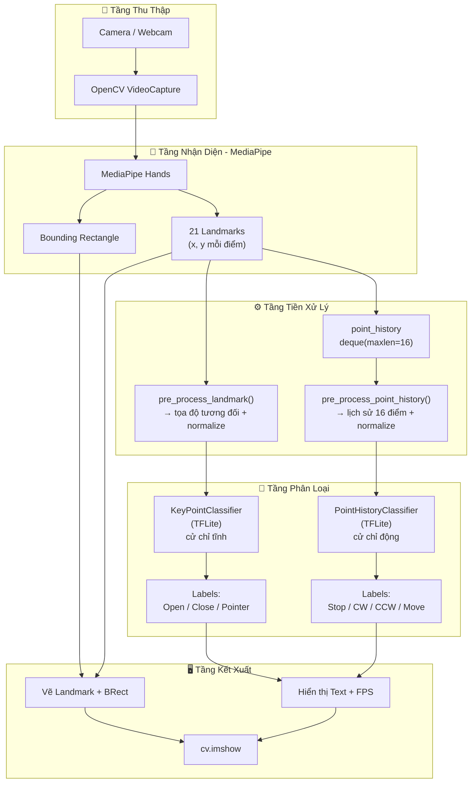

---

## 2. Luồng Khởi Động Ứng Dụng

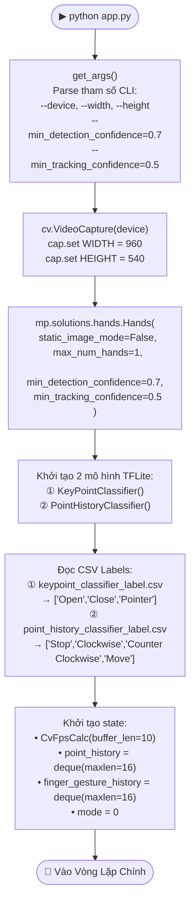

---

## 3. Vòng Lặp Xử Lý Chính

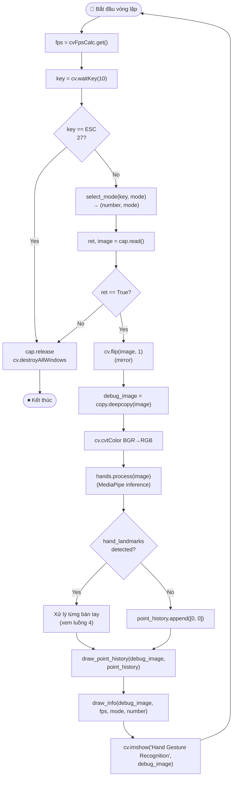

---

## 4. Luồng Phát Hiện Tay & Trích Xuất Landmark

```mermaid
flowchart TD
    INPUT["results.multi_hand_landmarks\n(danh sách bàn tay phát hiện)"]

    INPUT --> FOR_LOOP["for hand_landmarks, handedness\nin zip(...)"]

    FOR_LOOP --> BRECT["calc_bounding_rect(\n  debug_image, hand_landmarks\n)\n→ [x1, y1, x2, y2]"]

    FOR_LOOP --> LM_CALC["calc_landmark_list(\n  debug_image, hand_landmarks\n)\n→ 21 điểm [[x,y], ...]"]

    BRECT --> PRE_PROC
    LM_CALC --> PRE_PROC

    PRE_PROC["Tiền xử lý\n(xem luồng 5)"]

    PRE_PROC --> LOG["logging_csv(\n  number, mode,\n  landmark_list,\n  point_history_list\n)"]

    LOG --> KP_CLASSIFY["keypoint_classifier(\npre_processed_landmark_list\n)\n→ hand_sign_id"]

    KP_CLASSIFY --> IS_POINTER{hand_sign_id\n== 2 (Pointer)?}

    IS_POINTER -- Yes --> APPEND_PH["point_history.append(\n  landmark_list[8]\n)\n(đầu ngón trỏ)"]

    IS_POINTER -- No --> APPEND_ZERO["point_history.append([0, 0])"]

    APPEND_PH --> PH_CLASSIFY
    APPEND_ZERO --> PH_CLASSIFY

    PH_CLASSIFY["Phân loại cử chỉ động\n(xem luồng 7)"]

    PH_CLASSIFY --> FG_HIST["finger_gesture_history.append(\n  finger_gesture_id\n)"]

    FG_HIST --> MOST_COMMON["Counter(finger_gesture_history)\n.most_common()\n→ most_common_fg_id"]

    MOST_COMMON --> DRAWING["Vẽ kết quả\n(xem luồng 9)"]
```

---

## 5. Luồng Tiền Xử Lý Dữ Liệu

### 5a. Tiền xử lý Landmark (cho KeyPoint Classifier)

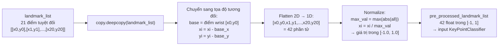

### 5b. Tiền xử lý Point History (cho Point History Classifier)

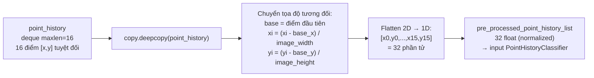

---

## 6. Luồng Phân Loại Cử Chỉ Tĩnh (KeyPoint Classifier)

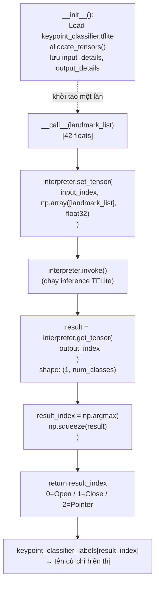

---

## 7. Luồng Phân Loại Cử Chỉ Động (Point History Classifier)

```mermaid
flowchart TD
    INIT2["__init__():\nLoad point_history_classifier.tflite\nallocate_tensors()\nscore_th = 0.5\ninvalid_value = 0"]

    CHECK_LEN{len(pre_processed_\npoint_history_list)\n== history_length * 2\n== 32?}

    CHECK_LEN -- No --> SKIP["finger_gesture_id = 0\n(chưa đủ dữ liệu)"]

    CHECK_LEN -- Yes --> CALL2["__call__(point_history)\n[32 floats]"]

    INIT2 -.->|khởi tạo một lần| CALL2

    CALL2 --> SET_T2["interpreter.set_tensor(\n  input_index,\n  np.array([point_history], float32)\n)"]

    SET_T2 --> INV2["interpreter.invoke()"]

    INV2 --> GET_T2["result = interpreter.get_tensor(\n  output_index\n)"]

    GET_T2 --> ARG2["result_index = np.argmax(\n  np.squeeze(result)\n)"]

    ARG2 --> THRESH{score[result_index]\n>= score_th\n(0.5)?}

    THRESH -- No --> INVALID["result_index = invalid_value (0)\n→ 'Stop'"]

    THRESH -- Yes --> VALID["return result_index\n0=Stop / 1=CW / 2=CCW / 3=Move"]

    SKIP --> FG_OUT
    INVALID --> FG_OUT
    VALID --> FG_OUT

    FG_OUT["finger_gesture_id\n→ finger_gesture_history.append()\n→ most_common() voting"]
```

---

## 8. Luồng Quản Lý Chế Độ & Ghi Dữ Liệu Huấn Luyện

### 8a. Quản lý phím bấm

```mermaid
flowchart TD
    KEY_INPUT["key = cv.waitKey(10)"]

    KEY_INPUT --> DIGIT{48 ≤ key ≤ 57\n(phím '0'-'9')?}
    DIGIT -- Yes --> NUM["number = key - 48\n(0 đến 9)"]
    DIGIT -- No --> NUM0["number = -1"]

    NUM --> MODE_CHECK
    NUM0 --> MODE_CHECK

    MODE_CHECK --> KEY_N{key == 110\n'n'?}
    KEY_N -- Yes --> MODE0["mode = 0\n(Normal mode)"]
    KEY_N -- No --> KEY_K{key == 107\n'k'?}

    KEY_K -- Yes --> MODE1["mode = 1\n(Logging Keypoint)"]
    KEY_K -- No --> KEY_H{key == 104\n'h'?}

    KEY_H -- Yes --> MODE2["mode = 2\n(Logging Point History)"]
    KEY_H -- No --> UNCHANGED["mode không đổi"]

    MODE0 --> RETURN_MODE["return number, mode"]
    MODE1 --> RETURN_MODE
    MODE2 --> RETURN_MODE
    UNCHANGED --> RETURN_MODE
```

### 8b. Ghi dữ liệu CSV

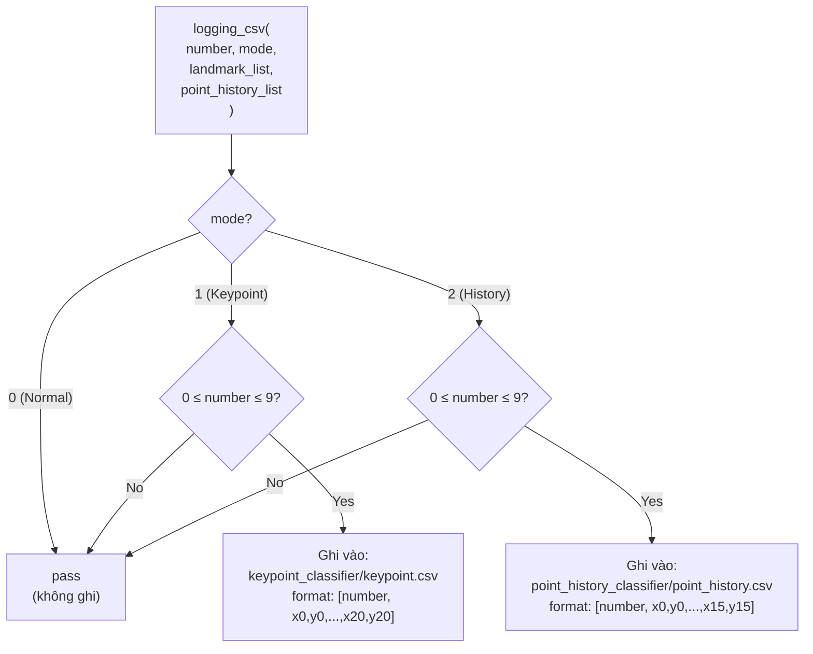

---

## 9. Luồng Kết Xuất Hình Ảnh

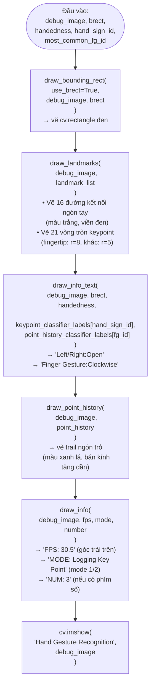

---

## 10. Luồng Xử Lý Toàn Bộ Một Frame

Sơ đồ tổng hợp toàn bộ pipeline xử lý từ một frame camera đến hình ảnh kết quả:

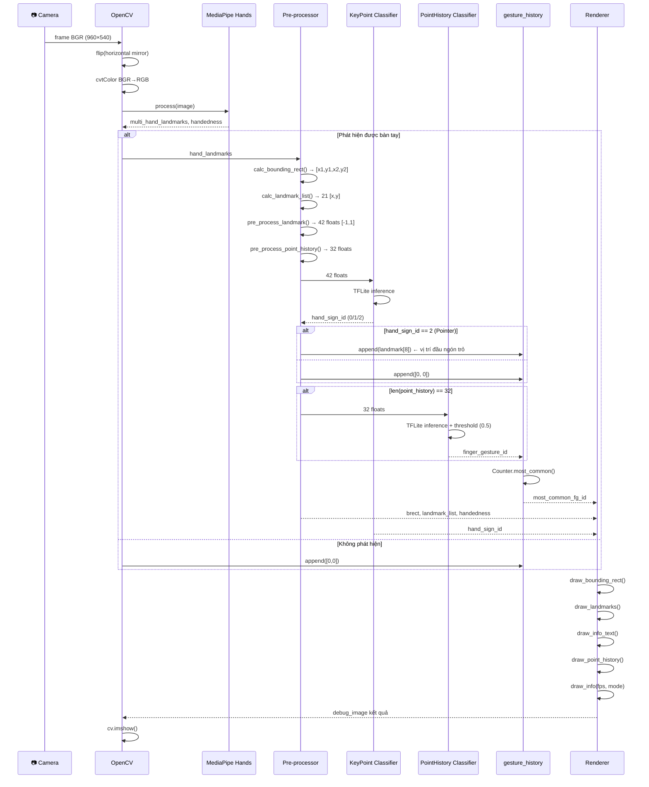

---

## 11. Sơ Đồ Thành Phần Hệ Thống

```mermaid
graph LR
    subgraph app["app.py — Điều phối chính"]
        MAIN[main()]
        SEL[select_mode()]
        CALC_BR[calc_bounding_rect()]
        CALC_LM[calc_landmark_list()]
        PP_LM[pre_process_landmark()]
        PP_PH[pre_process_point_history()]
        LOG_CSV[logging_csv()]
        subgraph draw_funcs["Hàm vẽ"]
            DR_BR[draw_bounding_rect()]
            DR_LM[draw_landmarks()]
            DR_IT[draw_info_text()]
            DR_PH[draw_point_history()]
            DR_IN[draw_info()]
        end
    end

    subgraph models["model/"]
        subgraph kp["keypoint_classifier/"]
            KPC_PY[keypoint_classifier.py]
            KPC_TF[keypoint_classifier.tflite]
            KPC_CSV[keypoint_classifier_label.csv]
            KP_DATA[keypoint.csv — training data]
        end
        subgraph ph["point_history_classifier/"]
            PHC_PY[point_history_classifier.py]
            PHC_TF[point_history_classifier.tflite]
            PHC_CSV[point_history_classifier_label.csv]
            PH_DATA[point_history.csv — training data]
        end
    end

    subgraph utils["utils/"]
        FPS[cvfpscalc.py\nCvFpsCalc]
    end

    subgraph ext["Thư viện ngoài"]
        CV2[OpenCV cv2]
        MEDIAPIPE[MediaPipe]
        TFLITE[TFLite Runtime]
        NUMPY[NumPy]
    end

    MAIN --> SEL
    MAIN --> CALC_BR
    MAIN --> CALC_LM
    MAIN --> PP_LM
    MAIN --> PP_PH
    MAIN --> LOG_CSV
    MAIN --> draw_funcs
    MAIN --> FPS

    KPC_PY --> KPC_TF
    KPC_PY --> TFLITE
    PHC_PY --> PHC_TF
    PHC_PY --> TFLITE

    MAIN --> KPC_PY
    MAIN --> PHC_PY
    MAIN --> CV2
    MAIN --> MEDIAPIPE
    MAIN --> NUMPY

    LOG_CSV -->|mode=1| KP_DATA
    LOG_CSV -->|mode=2| PH_DATA
    KPC_PY -->|đọc labels| KPC_CSV
    PHC_PY -->|đọc labels| PHC_CSV
```

---

## 12. Sơ Đồ Trạng Thái Chế Độ

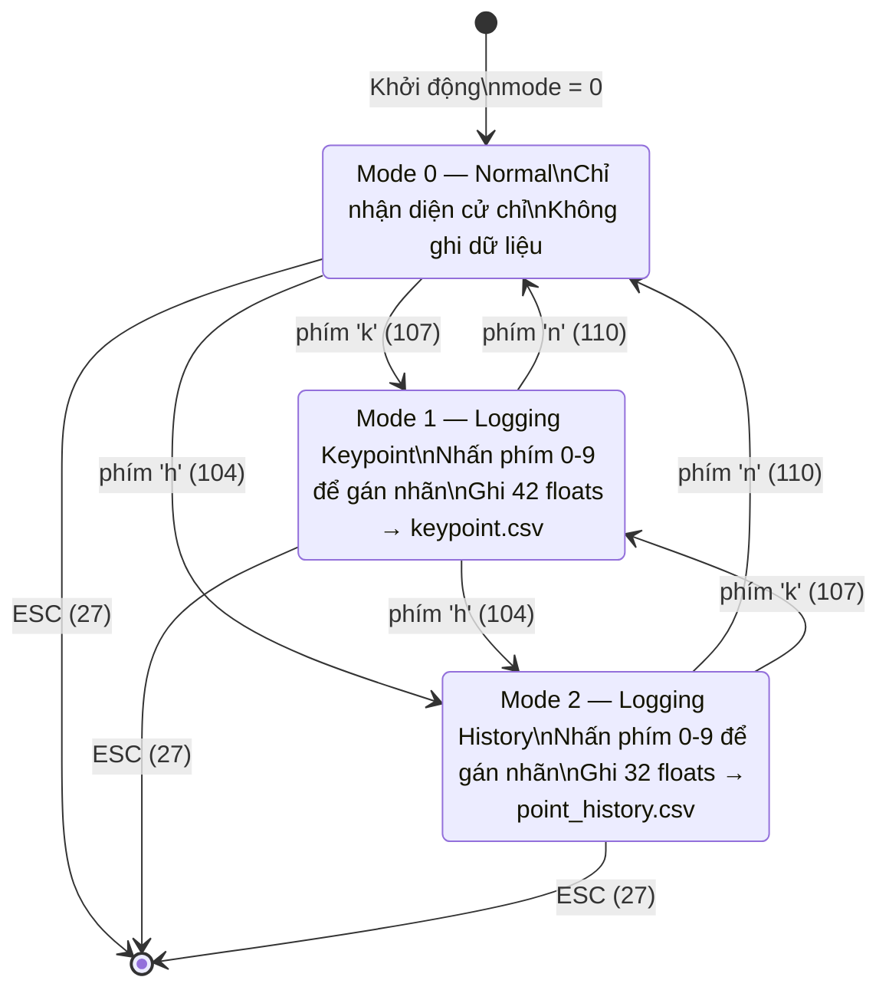

---

## 13. Luồng Pipeline Mô Hình TFLite

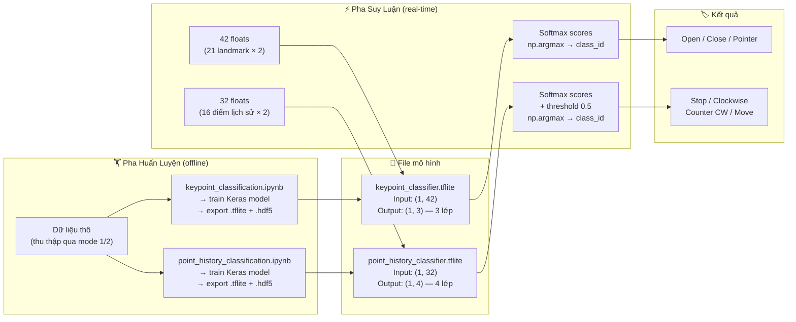

---

## Tóm Tắt Luồng Dữ Liệu Tổng Quát

| Bước | Đầu vào         | Xử lý                             | Đầu ra                          |
| ---- | --------------- | --------------------------------- | ------------------------------- |
| 1    | Camera frame    | `cv.VideoCapture.read()` + flip   | BGR image 960×540               |
| 2    | BGR image       | `cvtColor BGR→RGB`                | RGB image                       |
| 3    | RGB image       | `MediaPipe Hands.process()`       | 21 landmark + handedness        |
| 4    | 21 landmark     | `calc_landmark_list()`            | 21 điểm `[x,y]` tuyệt đối       |
| 5    | 21 điểm pixel   | `pre_process_landmark()`          | 42 floats trong `[-1, 1]`       |
| 6    | 42 floats       | `KeyPointClassifier` (TFLite)     | `hand_sign_id` ∈ {0,1,2}        |
| 7    | 16 điểm lịch sử | `pre_process_point_history()`     | 32 floats normalized            |
| 8    | 32 floats       | `PointHistoryClassifier` (TFLite) | `finger_gesture_id` ∈ {0,1,2,3} |
| 9    | gesture_id × 16 | `Counter.most_common()`           | gesture ổn định nhất            |
| 10   | Tất cả kết quả  | `draw_*()` functions              | Frame kết xuất + text           |

---

_Báo cáo được tạo tự động từ phân tích mã nguồn dự án hand-gesture-recognition-using-mediapipe._
