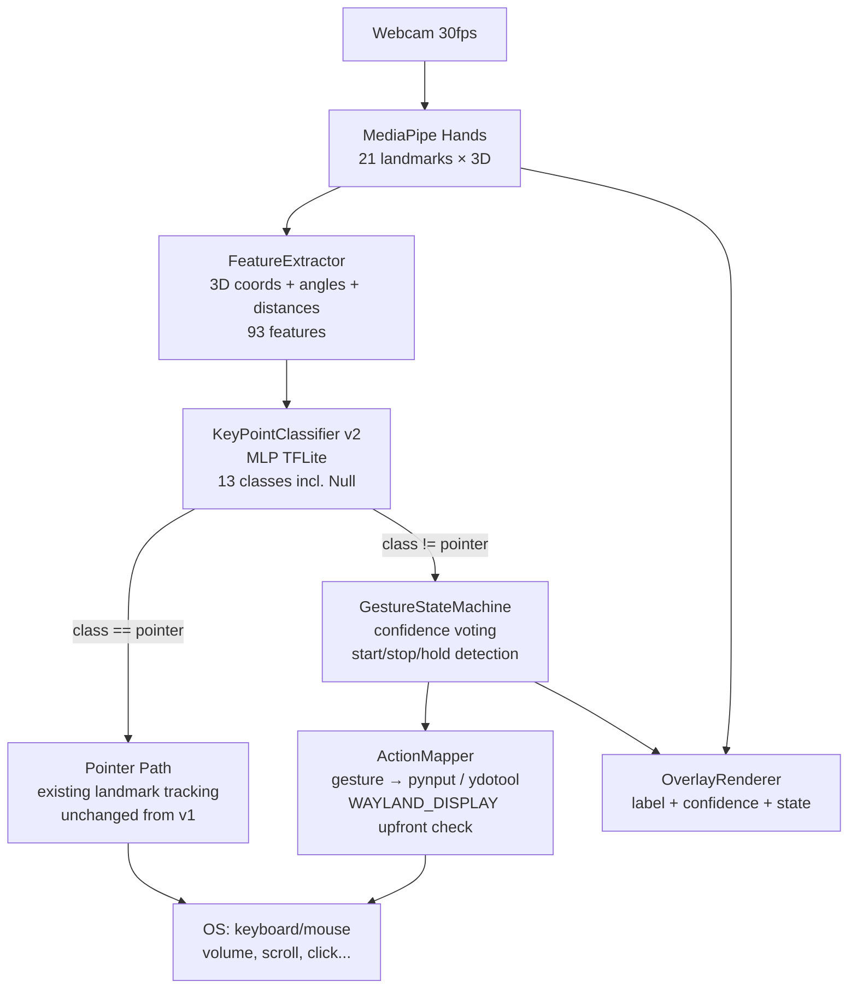

# System Design & Architecture

## Architecture Overview



**Pipeline latency budget:**

| Stage                          | Budget     |
| ------------------------------ | ---------- |
| MediaPipe Hands                | ~15–25ms   |
| FeatureExtractor               | <1ms       |
| KeyPointClassifier v2 (TFLite) | <2ms       |
| GestureStateMachine            | <1ms       |
| ActionMapper + pynput          | <5ms       |
| **Total**                      | **< 35ms** |

---

## Data Models

### Feature Vector (93 features per frame)

```python
# Block 1: 3D normalized landmarks (63 features)
# - 21 keypoints × (x, y, z) — z is pseudo-depth from MediaPipe (relative, used as noisy signal)
# - Normalized: all relative to wrist (kp[0]), scaled by max 3D distance
# NOTE: z is included to help distinguish v_sign vs pointer (middle-finger depth difference)

# Block 2: Joint angles (15 features)
# - 5 fingers × 3 joints (MCP, PIP, DIP)
# - Angle in radians between consecutive bone vectors

# Block 3: Fingertip-to-wrist distances (5 features)
# - Euclidean distance: tip[i] → wrist, normalized

# Block 4: Fingertip-to-palmcenter distances (5 features)
# - Palm center = mean of kp[0,5,9,13,17]

# Block 5: Finger state binary (5 features)
# - 1 = straight (extended), 0 = bent
# - Heuristic: tip_y < pip_y (flipped y-axis)
```

### GestureState (dataclass)

```python
@dataclass
class GestureState:
    current_class: int          # class index, -1 = unknown
    confidence: float           # softmax max
    state: Literal["idle", "tracking", "active"]
    frame_count: int            # frames in current class
    last_emitted: int           # class index of last action emitted
    last_emitted_time: float    # timestamp for debounce
```

### GestureVocabulary

| Index | Name            | Action                 |
| ----- | --------------- | ---------------------- |
| 0     | `null`          | No action (Idle)       |
| 1     | `open_palm`     | Pause/Play media       |
| 2     | `fist`          | Mute toggle            |
| 3     | `pointer`       | Move cursor (existing) |
| 4     | `thumbs_up`     | Volume up              |
| 5     | `thumbs_down`   | Volume down            |
| 6     | `v_sign`        | Scroll up              |
| 7     | `three_fingers` | Scroll down            |
| 8     | `four_fingers`  | Brightness up          |
| 9     | `pinch`         | Left click             |
| 10    | `ok_sign`       | Right click            |
| 11    | `gun_sign`      | Next window / Alt+Tab  |
| 12    | `call_sign`     | Previous track         |

---

## Component Breakdown

### 1. `utils/feature_extractor.py` (New)

Replaces `pre_process_landmark()` in `app.py`.

```python
class FeatureExtractor:
    def extract(self, landmark_list: list[list[float]]) -> list[float]:
        """
        Input:  21 × [x, y, z] raw pixel coords
        Output: 93-dim normalized feature vector
        """
```

Responsibilities:

- Normalize to wrist-relative coordinates
- Compute joint angles
- Compute landmark distances
- Compute finger state booleans
- Return flat float32 list

### 2. `model/keypoint_classifier/keypoint_classifier_v2.py` (New)

Extended `KeyPointClassifier` that:

- Accepts 93-dim input (was 42)
- Returns `(class_index, confidence_scores)` instead of just `class_index`
- Model file: `keypoint_classifier_v2.tflite`

```python
class KeyPointClassifierV2:
    def __call__(self, features: list[float]) -> tuple[int, np.ndarray]:
        # Returns (argmax_class, softmax_scores)
```

### 3. `utils/gesture_state_machine.py` (New)

```python
class GestureStateMachine:
    CONFIDENCE_THRESHOLD = 0.82
    ACTIVATION_FRAMES    = 5      # frames to confirm gesture start
    DEACTIVATION_FRAMES  = 10     # frames of null/other to confirm end
    DEBOUNCE_SECONDS     = 0.5

    def update(self, class_id: int, scores: np.ndarray) -> GestureEvent | None:
        """
        Returns GestureEvent(gesture_name, type='start'|'end'|'hold') or None.
        Call every frame when hand landmarks ARE detected.
        """

    def update_no_hand(self) -> None:
        """
        Call when no hand is detected in current frame (results.multi_hand_landmarks is None).
        Preserves ACTIVE state for 1s grace period — no events emitted while absent.
        After 1s without hand, silently resets to IDLE.
        """
```

State transitions:

```
IDLE ──[non-null class, conf > θ]──────────────────────────► TRACKING
TRACKING ──[same class × ACTIVATION_FRAMES, conf > θ]──────► ACTIVE → emit 'start'
TRACKING ──[class changes before ACTIVATION_FRAMES]────────► IDLE (reset)
ACTIVE ──[different class × DEACTIVATION_FRAMES]───────────► IDLE → emit 'end'
ACTIVE ──[debounce elapsed + same class + conf > θ]────────► ACTIVE → emit 'hold'
ACTIVE ──[update_no_hand(), elapsed < 1s]──────────────────► ACTIVE (grace, no emit)
ACTIVE ──[update_no_hand(), elapsed ≥ 1s]──────────────────► IDLE (silent reset)
IDLE / TRACKING ──[update_no_hand()]───────────────────────► unchanged
```

### 4. `utils/action_mapper.py` (New)

```python
class ActionMapper:
    """
    On init: checks os.environ.get('WAYLAND_DISPLAY').
    If set → uses ydotool subprocess for all input dispatch (Wayland-native).
    If not set → uses pynput Controller.

    Fires action on 'start' event always.
    Fires action on 'hold' event only if gesture has repeat: true in YAML config.
    'end' events currently ignored (no on_end actions in M1).
    """

    def handle(self, event: GestureEvent) -> None:
        """Translate GestureEvent → pynput / ydotool action."""
```

Mapping table stored in `config/gesture_actions.yaml`:

```yaml
# Supported on_start types: key_press | mouse_click | scroll | key_combo
# repeat: true  → also fires on 'hold' event (every DEBOUNCE_SECONDS while held)
# repeat: false → one-shot, 'hold' events ignored (default)

thumbs_up:
  on_start: key_press
  key: "XF86AudioRaiseVolume"
  repeat: true # volume increases while held
fist:
  on_start: key_press
  key: "XF86AudioMute"
  repeat: false # mute toggle: one-shot only
v_sign:
  on_start: scroll
  direction: up
  amount: 5
  repeat: true # continuous scroll while held
gun_sign:
  on_start: key_combo
  keys: ["alt", "tab"]
  repeat: false
pinch:
  on_start: mouse_click
  button: left
  repeat: false
# ...
```

### 5. `app.py` — Minimal surgical changes

- Import and wire new components
- **`pointer` gesture path is preserved unchanged** — when `hand_sign_id == class_index_of_pointer`, existing landmark tracking logic runs; GestureStateMachine is NOT called for pointer frames
- Add overlay: current state + gesture name + confidence bar
- When `results.multi_hand_landmarks is None`: call `gesture_state_machine.update_no_hand()` (1s grace period, then reset)

---

## Design Decisions

| Decision                        | Choice                                      | Rationale                                                                                          |
| ------------------------------- | ------------------------------------------- | -------------------------------------------------------------------------------------------------- |
| Feature size                    | 93 (not 42)                                 | Add z-depth + angles + distances; z helps distinguish v_sign vs pointer despite pseudo-depth noise |
| z-depth included                | Yes (noisy)                                 | Middle-finger z-difference is key discriminator for v_sign vs pointer; noise accepted              |
| Confidence threshold            | 0.82                                        | Balance FA/FR — tunable via config                                                                 |
| Null class strategy             | Explicit class (not threshold-based)        | More robust than "below threshold = null"                                                          |
| Action config                   | YAML external file                          | Allows remapping gestures without retraining                                                       |
| State machine vs. simple voting | State machine                               | More explicit start/end events, enables hold-action pattern                                        |
| pynput on Wayland               | pynput primary, ydotool fallback            | pynput may fail on Wayland compositor; ydotool is Wayland-native alternative                       |
| TFLite v2                       | Keep TFLite                                 | Consistent with existing pipeline, fast on CPU                                                     |
| pointer gesture path            | Separate (no ActionMapper)                  | Cursor control is continuous, not event-based; minimal change strategy                             |
| Joint angle base point          | Wrist (kp[0]) as base for all fingers       | Enables computing MCP angle; 5-element FINGER_JOINTS → `range(3)` = 3 angles/finger = 15 total     |
| No-hand API                     | Separate `update_no_hand()` method          | Cleaner separation of concerns vs. `no_hand=True` flag; caller logic simpler                       |
| Hold / repeat behavior          | Per-gesture `repeat: true\|false` in YAML   | Volume/scroll benefit from continuous fire; mute/click must be one-shot                            |
| Wayland detection               | Upfront `os.environ.get('WAYLAND_DISPLAY')` | Deterministic; avoids runtime exception ambiguity; XWayland users can unset env var                |

---

## Non-Functional Requirements

| Requirement                               | Target                               |
| ----------------------------------------- | ------------------------------------ |
| Pipeline FPS                              | ≥ 25 fps                             |
| Gesture activation latency                | < 200ms (5 frames @ 30fps ≈ 167ms)   |
| False positive rate (spurious OS actions) | < 5% in normal usage                 |
| New gesture addition                      | Collect 100 samples → retrain → done |
| Memory footprint (new code)               | < 50MB                               |
| `app.py` backward compat                  | Old args still work                  |
