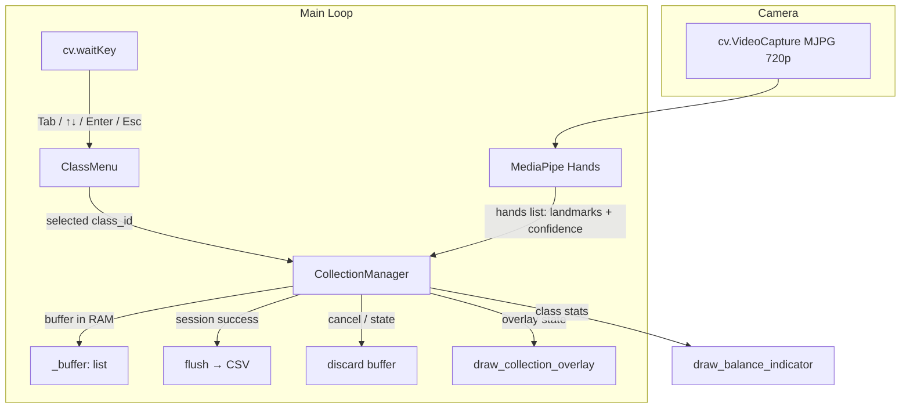
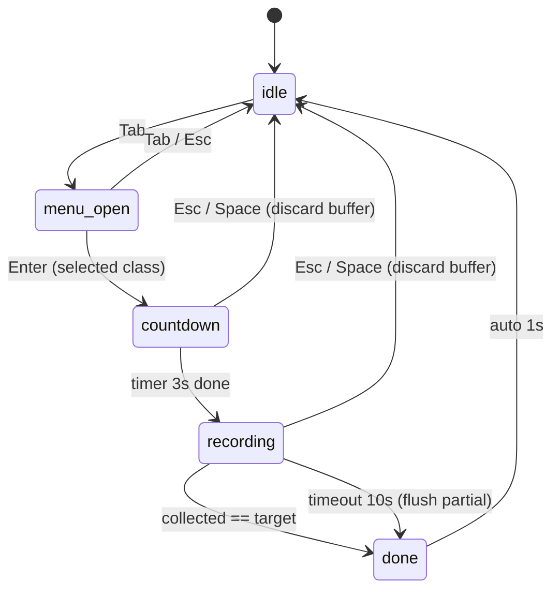

# System Design — Guided Gesture Collection UI

## Architecture Overview



**Core thay đổi so với hiện tại**:

1. Bỏ toggle mode `n` → thay bằng `ClassMenu` (Tab mở/đóng, ↑/↓ chọn class, Enter start session)
2. Thay logic latch `current_class → ghi mỗi frame` bằng `CollectionManager` FSM với RAM buffer
3. Class list đọc từ label CSV, không hardcode phím

## Data Models

### CollectionSession (dataclass)

```python
@dataclass
class CollectionSession:
    class_id: int
    target_count: int = 30        # default frames per session
    collected: int = 0            # frames accepted (not rows — multi-hand = 1 frame)
    countdown_end: float = 0.0    # timestamp khi countdown kết thúc
    quality_rejected: int = 0     # frames bị reject do low confidence
    started_at: float = 0.0
    timeout: float = 10.0         # seconds — auto-stop nếu không đủ sample
```

### ClassMenu (class)

```python
class ClassMenu:
    """Đọc label CSV, hiện danh sách class, xử lý ↑/↓/Enter navigation."""
    labels: list[str]             # loaded from keypoint_classifier_label.csv
    selected_index: int = 0
    visible: bool = False         # Tab toggles

    def toggle() -> None          # Tab key
    def move_up() -> None         # ↑ key
    def move_down() -> None       # ↓ key
    def confirm() -> int          # Enter key → returns class_id
    def reload_labels() -> None   # re-read CSV (hot reload khi sửa file)
    def draw(image) -> None       # render menu overlay on frame
```

### CollectionManager (class)

```python
class CollectionManager:
    state: Literal["idle", "countdown", "recording", "done"]
    session: Optional[CollectionSession]
    batch_size: int = 30          # configurable via +/- keys
    frame_skip: int = 2           # ghi 1 frame mỗi N frame (diversity)
    class_counts: dict[int, int]  # persistent per-class counter (loaded from CSV on startup)
    _buffer: list[list[float]]    # RAM buffer — flush on success, discard on cancel
    _frame_counter: int = 0       # đếm frame để skip

    def start_session(class_id: int) -> None
    def on_frame(hands: list[HandData]) -> int  # returns count accepted (0, 1, or 2)
    def cancel() -> None                        # discard entire buffer
    def _flush_to_csv() -> None                 # write buffer to CSV (only on success)
    def get_overlay_state() -> dict
```

**`HandData`** = named tuple/dataclass: `(landmarks: list, confidence: float)`

### State Transitions



**Key rules:**

- Cancel (Esc/Space) during countdown or recording → **discard entire buffer**, 0 rows written
- Timeout → **flush partial** (samples passed quality gate, chỉ thiếu số lượng)
- `collected` đếm **frames accepted** (không phải rows). 2 tay trong 1 frame = collected +1 nhưng buffer +2 rows
- Frame skip: `_frame_counter` tăng mỗi frame, chỉ process khi `_frame_counter % frame_skip == 0`

### CSV Format (unchanged)

```
class_id, feat_0, feat_1, ..., feat_92
```

Backward-compatible, append-only.

## Component Breakdown

### 1. `utils/class_menu.py` (new)

- `ClassMenu` class
- Load labels from `keypoint_classifier_label.csv` on init
- ↑/↓ navigation, Enter confirm, Tab toggle visibility
- Draw semi-transparent menu overlay with highlighted selection
- Hot-reload: re-read CSV mỗi lần toggle open (label thêm/xóa tự cập nhật)

### 2. `utils/collection_manager.py` (new)

- `CollectionManager` class
- FSM logic: idle → countdown → recording → done
- **RAM buffer**: `_buffer: list[list[float]]` — append feature vectors, flush on success
- **Quality gate**: reject frame if ALL hands have confidence < 0.7
- **Frame skip**: `_frame_counter % frame_skip != 0` → skip frame (per-frame, cả 2 tay cùng skip)
- **Multi-hand**: `on_frame(hands)` iterates all hands passing quality gate, appends each as separate row
- **Timeout**: check `time.time() - session.started_at > timeout` → transition to `done` + flush partial
- **Cancel**: discard `_buffer`, reset to idle
- Auto-count từ existing CSV on init (`class_counts`)

### 3. Camera MJPG upgrade (app.py)

```python
cap = cv.VideoCapture(cap_device)
cap.set(cv.CAP_PROP_FOURCC, cv.VideoWriter_fourcc(*'MJPG'))
cap.set(cv.CAP_PROP_FRAME_WIDTH, 1280)
cap.set(cv.CAP_PROP_FRAME_HEIGHT, 720)
```

Đã xác nhận webcam hỗ trợ MJPG 1280×720@30fps. YUYV chỉ được 10fps ở 720p.

### 4. Overlay system (draw functions in app.py)

| State       | Hiển thị                                                                                 |
| ----------- | ---------------------------------------------------------------------------------------- |
| `idle`      | Balance indicator ở góc (nếu có data). Không hiện gì đặc biệt                            |
| `menu_open` | Danh sách class bên trái frame, highlight class đang chọn, hiện sample count mỗi class   |
| `countdown` | Số lớn giữa màn hình `3... 2... 1...` + class name + "Giữ tay đúng pose!"                |
| `recording` | `[REC ●] thumbs_up 12/30` + progress bar + green border                                  |
| `done`      | `✓ 30 frames saved for thumbs_up` hoặc `⚠ Timeout: 18/30 frames saved` (1s rồi tự clear) |

### 5. Balance indicator

Tính % sample per class, hiện bar chart nhỏ ở góc phải:

```
null     ████████░░ 200
open_palm████████████ 300
fist     ██████░░░░ 150
pointer  ██░░░░░░░░  50  ← NEEDS MORE
```

## Design Decisions

| Quyết định                       | Lý do                                           | Alternative rejected                                  |
| -------------------------------- | ----------------------------------------------- | ----------------------------------------------------- |
| Session 30 frames (auto-stop)    | Đủ diversity nếu xoay tay nhẹ, không quá lâu    | Continuous stream (duplicate, quên dừng)              |
| Countdown 3s                     | Cho thời gian setup tay đúng pose               | Immediate start (capture lúc tay chưa sẵn sàng)       |
| Quality gate ≥ 0.7 confidence    | Loại frame detect kém                           | No gate (data nhiễu)                                  |
| MJPG codec cho 720p              | 30fps thay vì 10fps ở YUYV                      | Giữ 640×480 (góc hẹp)                                 |
| Class menu từ label CSV          | Scale > 13 class, tự sync khi sửa CSV           | Hardcode phím 0-9/a-c (không scale, phải sửa code)    |
| Bỏ toggle `n`, dùng `Tab`        | Đơn giản hơn, không cần nhớ "đang ở mode nào"   | Giữ `n` toggle (thêm 1 bước thao tác không cần thiết) |
| RAM buffer + flush on success    | An toàn cho cancel = discard, không data rác    | Append trực tiếp CSV (phải rollback nếu cancel)       |
| Frame skip (1 mỗi 2-3 frame)     | Diversity giữa samples, tránh duplicate liền    | Ghi mỗi frame (mỗi giây 30 sample giống nhau)         |
| Timeout 10s → flush partial      | Sample đã qua quality gate vẫn có giá trị       | Timeout → discard (mất data tốt)                      |
| Multi-hand ghi cả 2              | Chuẩn bị gesture 2 tay tương lai                | Chỉ tay confidence cao nhất (mất data)                |
| `collected` đếm frame, không row | User nghĩ "30 lần capture" không phải "60 rows" | Đếm row (batch size phải x2 khi 2 tay, confusing)     |

## Non-Functional Requirements

- **Latency**: overlay render < 5ms per frame (không ảnh hưởng inference FPS)
- **Data integrity**: không ghi sample sai class dưới bất kỳ sequence key press nào
- **Backward compat**: CSV format unchanged, existing data vẫn dùng được
