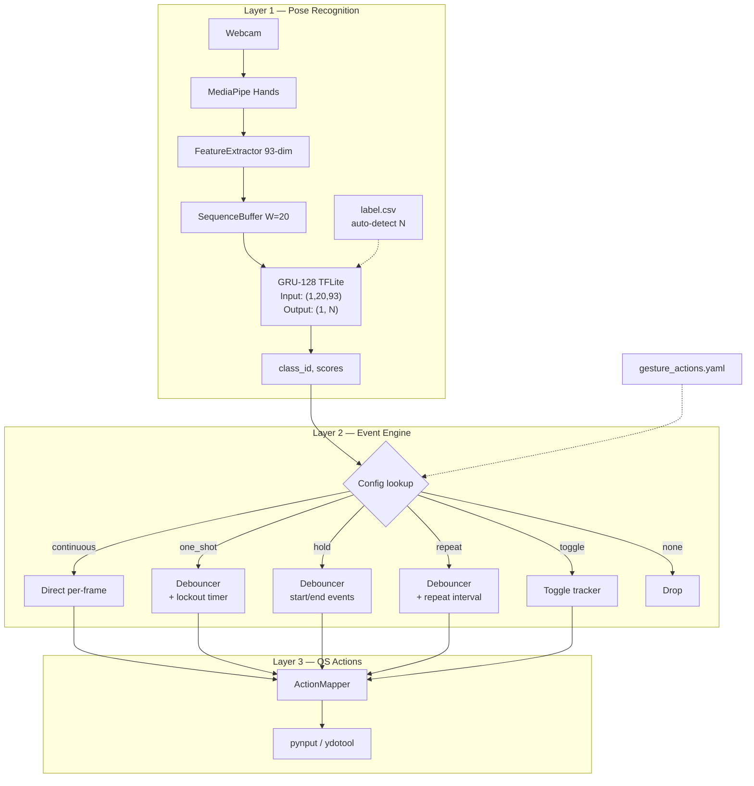

# Scalable Gesture System — Redesign từ đầu

## Table of Contents

1. [Step-back Analysis: Vấn đề gốc](#1-step-back-analysis)
2. [Gesture Taxonomy: Bản chất cử chỉ](#2-gesture-taxonomy)
3. [Model Capacity Assessment](#3-model-capacity-assessment)
4. [Action Type System](#4-action-type-system)
5. [Data Collection Redesign](#5-data-collection-redesign)
6. [Scalable Architecture](#6-scalable-architecture)
7. [Migration Plan](#7-migration-plan)

---

## 1. Step-back Analysis

### 1.1 Vấn đề hiện tại

Hệ thống hiện tại gắn chặt **pose** (hình dạng tay) với **action** (hành vi OS). Đây là thiết kế sai về bản chất:

```
❌ Hiện tại: Gesture = Pose + Action (coupled)
   "left_click" = pinch shape + click behavior
   "pointer_move" = index finger + cursor control
   "scroll_mode" = V-sign + scroll behavior

✅ Đúng: Gesture = Pose recognition (pure classification)
         Action = Mapping layer riêng (configurable)
```

**Hệ quả:**

- Thêm gesture mới = sửa code ở 5+ files (labels, model, app.py, action_mapper, debouncer)
- `pointer_move` và `scroll_mode` hardcoded bypass state machine bằng class ID
- Click fire liên tục vì Debouncer không phân biệt one-shot vs hold gesture
- Không thể dùng cùng 1 pose cho actions khác nhau (context-dependent)

### 1.2 Insight chính: Tách 3 tầng

```
┌─────────────────────────────────────────────────────┐
│  Layer 1: POSE RECOGNITION (model output)           │
│  "Tay đang ở hình dạng gì?"                         │
│  → Pure classification, no action semantics         │
│  → Scalable: thêm class = thêm data + retrain      │
│  Ex: open_palm, fist, index_point, pinch, v_sign... │
├─────────────────────────────────────────────────────┤
│  Layer 2: GESTURE INTERPRETATION (event engine)     │
│  "Cử chỉ này có ý nghĩa gì?"                       │
│  → Xác định: one-shot, hold, continuous, toggle     │
│  → Debounce, deactivation buffer, cooldown          │
│  Ex: pinch detected → emit "pinch_tap" one-shot     │
│  Ex: index_point held → emit "pointing" continuous  │
├─────────────────────────────────────────────────────┤
│  Layer 3: ACTION MAPPING (config-driven)            │
│  "Thực hiện hành động OS nào?"                       │
│  → YAML config, user-customizable                   │
│  → Không chứa logic phân loại                       │
│  Ex: pinch_tap → left_click                         │
│  Ex: pointing → cursor_move                         │
└─────────────────────────────────────────────────────┘
```

---

## 2. Gesture Taxonomy: Bản chất cử chỉ

### 2.1 Pose Classes (Layer 1 — model output)

Đặt tên theo **hình dạng vật lý**, không theo action:

| ID  | Pose Name       | Mô tả vật lý                                   | Ngón thẳng                  |
| --- | --------------- | ---------------------------------------------- | --------------------------- |
| 0   | `null`          | Tay thả lỏng, đang chuyển đổi, hoặc vắng mặt   | any                         |
| 1   | `index_point`   | Chỉ ngón trỏ dựng, còn lại gập                 | index                       |
| 2   | `pinch`         | Đầu ngón cái chạm đầu ngón trỏ                 | thumb+index (tips touching) |
| 3   | `fist`          | Nắm chặt tất cả ngón                           | none                        |
| 4   | `v_sign`        | Ngón trỏ + giữa dựng (chữ V)                   | index+middle                |
| 5   | `open_palm`     | 5 ngón xòe                                     | all                         |
| 6   | `thumbs_up`     | Ngón cái dựng, còn lại gập                     | thumb                       |
| 7   | `thumbs_down`   | Ngón cái chỉ xuống, còn lại gập                | thumb (inverted)            |
| 8   | `three_fingers` | 3 ngón (trỏ+giữa+áp út) dựng                   | index+middle+ring           |
| 9   | `ok_sign`       | Ngón cái+trỏ tạo vòng, 3 ngón còn lại xòe      | middle+ring+pinky           |
| 10  | `call_sign`     | Ngón cái+út dựng, còn lại gập (📞)             | thumb+pinky                 |
| 11  | `pinch_hold`    | Giống pinch nhưng giữ lâu (model học temporal) | thumb+index (sustained)     |

> **Lưu ý**: `pinch` vs `pinch_hold` — Đây là 2 class riêng biệt mà GRU có thể phân biệt dựa trên temporal pattern (duration). MLP không phân biệt được.

### 2.2 Tại sao tách theo bản chất?

1. **Reusable**: `pinch` có thể map tới left_click, right_click, hoặc confirm tùy context
2. **Extensible**: Thêm `gun_sign`, `rock_sign`, `L_sign`... chỉ cần collect data + retrain
3. **Debuggable**: Model output luôn có ý nghĩa rõ ràng bất kể action mapping
4. **No code change**: Thêm class mới KHÔNG cần sửa app.py hay debouncer

### 2.3 Mở rộng tương lai (20+ classes)

Danh sách candidate cho milestone sau:

| ID  | Pose Name         | Mô tả                         |
| --- | ----------------- | ----------------------------- |
| 12  | `gun_sign`        | Ngón trỏ+cái dựng (hình súng) |
| 13  | `rock_sign`       | Ngón trỏ+út dựng (🤘)         |
| 14  | `L_sign`          | Ngón trỏ+cái vuông góc (L)    |
| 15  | `middle_finger`   | Chỉ ngón giữa dựng            |
| 16  | `pinky_point`     | Chỉ ngón út dựng              |
| 17  | `finger_gun_fire` | gun_sign + flick (temporal)   |
| 18  | `spread_pinch`    | Pinch mở ra (zoom gesture)    |
| 19+ | Custom...         | User-defined poses            |

---

## 3. Model Capacity Assessment

### 3.1 GRU-64 hiện tại: đủ cho bao nhiêu class?

**Thông số hiện tại:**

| Metric       | Giá trị   |
| ------------ | --------- |
| Hidden units | 64        |
| Parameters   | ~30,853   |
| Input        | (20, 93)  |
| Output       | 5 classes |
| TFLite size  | ~91.7 KB  |
| Latency      | ~0.10ms   |

**Phân tích capacity:**

Công thức ước lượng: mỗi class cần ~10-15 hidden dims để encode discriminative features.

| Num Classes | Dims needed | GRU-64 đủ?   | Ghi chú                                  |
| ----------- | ----------- | ------------ | ---------------------------------------- |
| 5           | ~50-75      | ✅ Thoải mái | Hiện tại, overlap margin tốt             |
| 10-12       | ~100-180    | ⚠️ Ranh giới | Cần classes phân biệt rõ ràng            |
| 15-20       | ~150-300    | ❌ Không đủ  | Accuracy sẽ giảm, đặc biệt similar poses |
| 25+         | ~250-375    | ❌ Thiếu     | Cần GRU-128 hoặc multi-layer             |

### 3.2 Upgrade path cho 20+ classes

| Architecture      | Hidden | Params | TFLite size | Latency | Max classes |
| ----------------- | ------ | ------ | ----------- | ------- | ----------- |
| GRU-64 (hiện tại) | 64     | ~31K   | ~92 KB      | ~0.10ms | ~10-12      |
| **GRU-128**       | 128    | ~86K   | ~200 KB     | ~0.15ms | ~20-25      |
| GRU-128×2 layers  | 128×2  | ~153K  | ~350 KB     | ~0.25ms | ~30-40      |
| BiGRU-64          | 64×2   | ~62K   | ~180 KB     | ~0.20ms | ~15-20      |

**Đề xuất: GRU-128 (single layer)**

```python
# Đủ cho 20-25 classes, latency vẫn < 0.5ms
model = tf.keras.Sequential([
    Input((WINDOW_SIZE, NUM_FEATURES)),      # (20, 93)
    GRU(128, unroll=True),                   # 128 hidden units
    Dropout(0.3),
    Dense(NUM_CLASSES, activation='softmax'), # NUM_CLASSES từ label file
])
# Params: ~86K (+178% vs GRU-64)
# TFLite:  ~200 KB (+118%)
# Latency: ~0.15ms (+50%, vẫn không đáng kể)
```

### 3.3 Kết luận model

1. **Ngay bây giờ (12 classes)**: GRU-64 **đủ** nhưng ở ranh giới. Nên upgrade lên GRU-128 để có margin.
2. **Mở rộng 20+ classes**: GRU-128 single layer là lựa chọn tối ưu (Pareto: accuracy vs latency).
3. **Feature vector 93-dim**: Đủ discriminative cho 20+ poses. Không cần thay đổi.
4. **Window size 20**: Đủ (0.67s) cho phân biệt one-shot vs hold. Có thể giữ nguyên.

---

## 4. Action Type System

### 4.1 Phân loại hành vi (Layer 2)

Mỗi gesture khi map sang action cần xác định **action_type** — cách mà event engine xử lý:

| Action Type  | Mô tả                                         | Ví dụ                  | Event flow                  |
| ------------ | --------------------------------------------- | ---------------------- | --------------------------- |
| `one_shot`   | Fire 1 lần khi gesture activated, lockout sau | left_click, screenshot | `start` → lockout N giây    |
| `hold`       | Fire start/end, không repeat                  | drag, button hold      | `start` → ... → `end`       |
| `continuous` | Bypass debouncer, fire mỗi frame              | cursor move, scroll    | Direct per-frame            |
| `repeat`     | Fire liên tục theo interval khi giữ           | volume up liên tục     | `start` → `hold`... → `end` |
| `toggle`     | Bật/tắt mỗi lần activate                      | mute on/off            | `start` → toggle state      |

### 4.2 Gesture → Action mapping (YAML)

```yaml
# config/gesture_actions.yaml — scalable format

# === CONTINUOUS MODES (bypass event engine) ===
index_point:
  action_type: continuous
  action: cursor_move
  params:
    landmark_index: 8 # index fingertip

v_sign:
  action_type: continuous
  action: scroll
  params:
    landmark_index: 8
    direction: vertical

# === ONE-SHOT (fire once, lockout) ===
pinch:
  action_type: one_shot
  action: mouse_click
  params:
    button: left
  lockout_seconds: 1.0 # không fire lại trong 1s

ok_sign:
  action_type: one_shot
  action: mouse_click
  params:
    button: right
  lockout_seconds: 1.0

thumbs_up:
  action_type: one_shot
  action: key_combo
  params:
    keys: [ctrl, shift, equal] # zoom in
  lockout_seconds: 0.8

thumbs_down:
  action_type: one_shot
  action: key_combo
  params:
    keys: [ctrl, minus] # zoom out
  lockout_seconds: 0.8

# === HOLD (press on start, release on end) ===
fist:
  action_type: hold
  action: mouse_drag
  params:
    button: left

# === REPEAT (fire periodically while held) ===
three_fingers:
  action_type: repeat
  action: key_press
  params:
    key: space # page down
  repeat_interval: 0.5

# === TOGGLE ===
open_palm:
  action_type: toggle
  action: key_press
  params:
    key: space # play/pause
  lockout_seconds: 1.5

# === UNMAPPED (recognition only, no action) ===
null:
  action_type: none

call_sign:
  action_type: none # reserved for future
```

### 4.3 Xử lý one-shot: giải quyết click liên tục

**Vấn đề cũ:**

```
Frame 1-5:   pinch detected → Debouncer: start → ActionMapper: click ✅
Frame 6:     confidence drop → Debouncer: end
Frame 7-11:  pinch detected → Debouncer: start → ActionMapper: click ❌ (lặp!)
```

**Giải pháp: per-gesture lockout**

```
Frame 1-5:   pinch → start → click ✅ → lockout bắt đầu (1.0s)
Frame 6:     end
Frame 7-11:  pinch → start → BLOCKED (trong lockout) ❌
Frame 30+:   pinch → start → click ✅ (lockout hết)
```

Lockout timer reset sau mỗi lần fire thành công, tính theo wall-clock time.

### 4.4 Deactivation buffer cho Debouncer

Hiện tại Debouncer emit `end` ngay khi 1 frame null → gây re-trigger. Thêm buffer:

```python
# Debouncer thêm deactivation_frames (default 3)
# Cần 3 frame liên tiếp null/khác class mới emit "end"
# Tránh jitter 1-2 frame gây end → start → click lặp
```

---

## 5. Data Collection Redesign

### 5.1 Step-back: Cần thu thập gì?

GRU temporal model cần **sequences**, không phải frames đơn lẻ. Nhưng khác biệt cốt lõi:

| Gesture behavior | Thu thập kiểu                      | Ví dụ                          |
| ---------------- | ---------------------------------- | ------------------------------ |
| **Static hold**  | Giữ pose N giây                    | index_point, v_sign, fist      |
| **One-shot**     | Thực hiện nhanh, lặp lại nhiều lần | pinch (tap), thumbs_up (flash) |
| **Transition**   | Chuỗi null → pose → null           | Pinch: relax → pinch → relax   |
| **Null/idle**    | Tay thả lỏng, di chuyển tự do      | Cần nhiều variation            |

### 5.2 Collection modes

```
┌─────────────────────────────────────────────────────┐
│  Mode 1: SUSTAINED (cho static hold gestures)       │
│                                                      │
│  Cách thu: Giữ pose → record liên tục 30s            │
│  Sliding window → nhiều sequences                    │
│  Dùng cho: index_point, v_sign, fist, open_palm      │
│                                                      │
│  GRU sẽ thấy: [pose, pose, pose, ..., pose]          │
│  → Học: "khi pose stable = class X"                   │
├─────────────────────────────────────────────────────┤
│  Mode 2: ONE-SHOT (cho quick gesture)                │
│                                                      │
│  Cách thu: Lặp lại gesture nhiều lần (relax→do→relax)│
│  Mỗi lần = 1 "burst"                                 │
│  Record liên tục 30-60s, tự extract bursts            │
│  Dùng cho: pinch (tap), thumbs_up (flash), ok_sign    │
│                                                      │
│  GRU sẽ thấy: [null, null, pinch, pinch, null, null]  │
│  → Học: "pinch xuất hiện ngắn giữa null = one-shot"   │
├─────────────────────────────────────────────────────┤
│  Mode 3: NULL VARIATION                              │
│                                                      │
│  Cách thu: Di chuyển tay tự do, đổi tư thế, đưa vào  │
│  ra frame → record liên tục 60s                       │
│  Dùng cho: null class                                 │
│                                                      │
│  GRU sẽ thấy: [random, random, ..., random]           │
│  → Học: "không có pattern rõ ràng = null"              │
└─────────────────────────────────────────────────────┘
```

### 5.3 Key insight: One-shot collection

Cho gestures dạng one-shot (pinch tap, thumbs_up flash), ta **KHÔNG** thu sustained hold. Thay vào đó:

1. Người dùng **lặp lại** gesture nhanh: relax → pinch → relax → pinch → ...
2. Recording liên tục 30-60 giây
3. Sliding window tự nhiên sẽ capture:
   - Sequences có transition: `[null..., pinch, ..., null]` → labeled `pinch`
   - Sequences toàn null: → bỏ qua (hoặc label `null`)
4. GRU học **temporal signature** của one-shot: ngắn, nhanh, có transition

**Vấn đề**: Với cách hiện tại, toàn bộ recording được label cùng 1 class. Nếu thu one-shot kiểu lặp, nhiều window sẽ chứa null frames nhưng vẫn labeled là gesture class → noise.

**Giải pháp**: 2 lựa chọn:

#### Option A: Label cả recording cùng class (simple, preferred cho MVP)

- Thu sustained: tất cả windows labeled class X → OK
- Thu one-shot: windows có transition vẫn labeled class X → model phải học transition pattern
- **Downside**: Some noise, nhưng GRU temporal pattern đủ robust

#### Option B: Auto-segment (advanced, cho sau)

- Dùng confidence threshold từ **pretrained model** để auto-label windows
- Windows có high-confidence activation = class X, còn lại = null
- **Downside**: Cần pretrained model trước, chicken-and-egg problem

**→ Chọn Option A cho MVP.** Thu one-shot bằng cách lặp, label cả recording. Noise sẽ được smooth bởi:

- Majority of windows vẫn chứa gesture signal
- GRU learns to weight informative frames
- Augmentation (crop window) giúp diversify

### 5.4 Collection UI changes

**Hiện tại:**

```
[Tab] → Class Menu → [Enter] → Countdown → Recording (N seconds) → Done
```

**Đề xuất thêm:**

```
[Tab] → Class Menu → [S/O] chọn mode → [Enter] → Recording → Done
                      S = Sustained (giữ pose)
                      O = One-shot (lặp lại nhanh)
```

Overlay hint thay đổi theo mode:

- **Sustained**: "Giữ pose ổn định..."
- **One-shot**: "Lặp lại nhanh: thả → làm → thả → làm..."

---

## 6. Scalable Architecture

### 6.1 Class-agnostic pipeline



### 6.2 Loại bỏ hardcoded class IDs

**Hiện tại trong app.py:**

```python
# ❌ Hardcoded
if hand_sign_id == 1:  # pointer_move → cursor
if hand_sign_id == 4:  # scroll_mode → scroll
```

**Đổi sang config-driven:**

```python
# ✅ Config-driven
action_config = gesture_actions.get(class_name)
if action_config and action_config["action_type"] == "continuous":
    if action_config["action"] == "cursor_move":
        # cursor control
    elif action_config["action"] == "scroll":
        # scroll control
```

Class names đọc từ `label.csv` → match với keys trong `gesture_actions.yaml`.
Thêm class mới = thêm row vào `label.csv` + entry vào YAML. **Zero code changes.**

### 6.3 Dynamic NUM_CLASSES

```python
# Hiện tại: hardcoded
NUM_CLASSES = 5

# Đổi sang: auto-detect từ label file
label_path = "model/temporal_classifier/temporal_classifier_label.csv"
with open(label_path) as f:
    labels = [line.strip() for line in f if line.strip()]
NUM_CLASSES = len(labels)
```

Training notebook, model definition, debouncer — tất cả đọc NUM_CLASSES từ label file.

### 6.4 File changes summary

| File                             | Thay đổi                                          |
| -------------------------------- | ------------------------------------------------- |
| `gesture_actions.yaml`           | Thêm `action_type`, `lockout_seconds`, `params`   |
| `utils/debouncer.py`             | Thêm deactivation buffer + per-gesture lockout    |
| `utils/action_mapper.py`         | Đọc `action_type` từ config, dispatch accordingly |
| `utils/gesture_state_machine.py` | `GESTURE_LABELS` đọc từ file thay vì hardcode     |
| `app.py`                         | Bỏ `if hand_sign_id == 1/4`, dùng config lookup   |
| `temporal_classification.ipynb`  | `NUM_CLASSES` auto-detect                         |
| `config/gesture_vocabulary.md`   | Update taxonomy                                   |
| Label CSV files                  | Rename classes theo taxonomy mới                  |

---

## 7. Migration Plan

### Phase 1: Immediate (fix one-shot bug)

**Goal**: Sửa click liên tục mà không redesign toàn bộ

1. Thêm `deactivation_frames` vào Debouncer (3 frames buffer)
2. Thêm `lockout_seconds` per action_type vào gesture_actions.yaml
3. ActionMapper check lockout trước khi fire one_shot actions
4. **Không đổi class names, model, hoặc collection**

**Effort**: ~2-3 giờ code + test

### Phase 2: Rename + Scalable config

**Goal**: Tách pose ↔ action, config-driven pipeline

1. Rename classes: `pointer_move` → `index_point`, `left_click` → `pinch`, etc.
2. Update label CSV files
3. Refactor app.py: bỏ hardcoded IDs, dùng config lookup
4. Refactor gesture_actions.yaml: full action_type system
5. **Retrain model** với class names mới (data giữ nguyên, chỉ đổi labels)

**Effort**: ~1 ngày

### Phase 3: GRU-128 + expanded classes

**Goal**: Scale lên 12+ classes

1. Upgrade model: GRU-64 → GRU-128
2. Thu thập data cho classes mới (6-7 classes thêm)
3. Collection UI: thêm sustained/one-shot mode selection
4. Train + eval + deploy

**Effort**: ~3-5 ngày (chủ yếu thu thập data)

### Phase 4: 20+ classes (future)

1. Thu thêm data, thêm classes
2. Nếu accuracy giảm → GRU-128×2 layers
3. Augmentation: time-warp, noise injection, hand mirroring

---

## Appendix A: Parameter Calculation

### GRU-128 (đề xuất)

```
GRU layer:
  Input-to-hidden: 93 × 128 × 3 = 35,712  (3 gates: z, r, h̃)
  Hidden-to-hidden: 128 × 128 × 3 = 49,152
  Biases: 128 × 3 × 2 = 768
  Subtotal: 85,632

Dense output (12 classes):
  128 × 12 + 12 = 1,548

Total: ~87,180 parameters
TFLite (float32): ~340 KB
TFLite (dynamic quant): ~170-200 KB
```

### GRU-128 (25 classes)

```
Dense: 128 × 25 + 25 = 3,225
Total: ~88,857
TFLite: ~200-210 KB   (kích thước gần như không đổi)
Latency: ~0.15ms      (không đáng kể so với MediaPipe ~15ms)
```

## Appendix B: Confusion Risk Matrix (12 classes)

| Pair                           | Risk | Discriminator                     |
| ------------------------------ | ---- | --------------------------------- |
| `index_point` vs `v_sign`      | HIGH | Middle finger z-depth + extension |
| `pinch` vs `index_point`       | MED  | Thumb-index tip distance          |
| `fist` vs `null` (rest)        | MED  | Finger tightness, intentionality  |
| `thumbs_up` vs `thumbs_down`   | LOW  | Thumb Y-direction (z-coord)       |
| `ok_sign` vs `pinch`           | MED  | 3 remaining fingers extended      |
| `open_palm` vs `three_fingers` | MED  | Pinky + thumb extension           |
| `call_sign` vs `rock_sign`     | LOW  | Middle+ring finger state          |

**Mitigation strategy**: Thu thập ≥200 sequences/class với variations (angle, distance, lighting). Confusion matrix evaluation sau mỗi training round.
