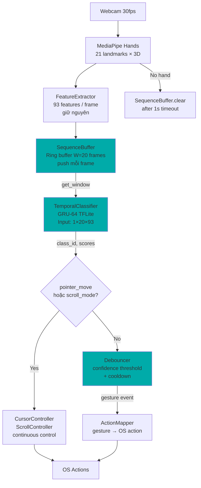
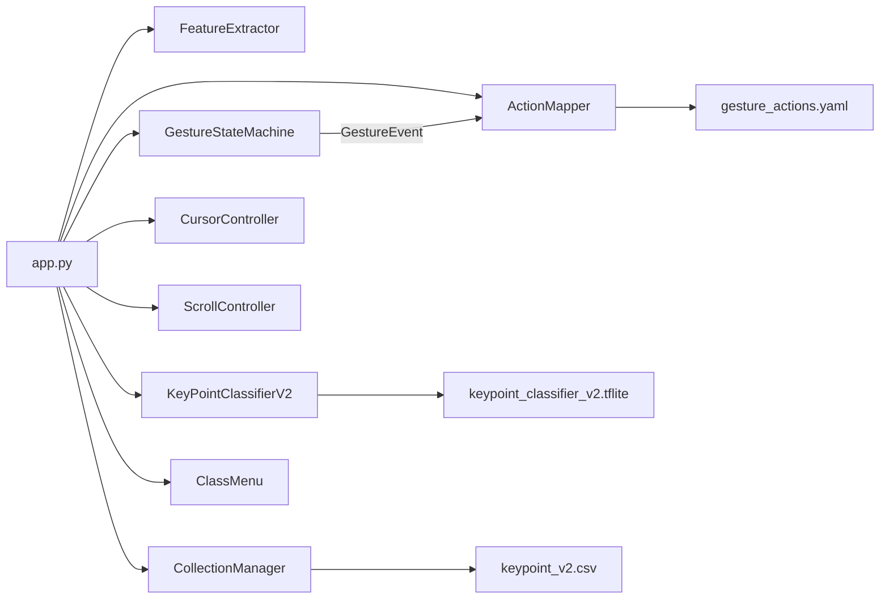
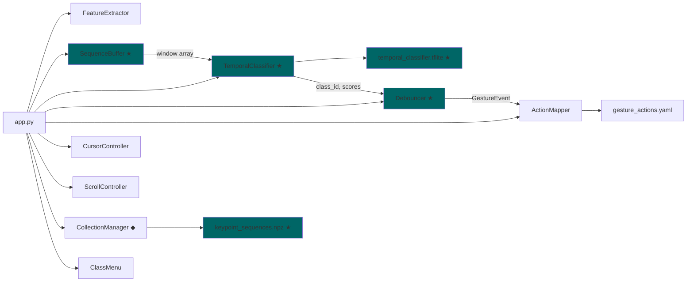

# GRU-64 Temporal Model — Design & Refactoring Plan

## Table of Contents

1. [Tổng quan mô hình GRU-64](#1-tổng-quan-mô-hình-gru-64)
2. [So sánh MLP vs GRU-64](#2-so-sánh-mlp-vs-gru-64)
3. [Kiến trúc hệ thống mới](#3-kiến-trúc-hệ-thống-mới)
4. [Current State Analysis](#4-current-state-analysis)
5. [Target State](#5-target-state)
6. [Affected Files](#6-affected-files)
7. [Data Format Migration](#7-data-format-migration)
8. [Execution Plan](#8-execution-plan)
9. [Rollback Plan](#9-rollback-plan)
10. [Risks & Mitigations](#10-risks--mitigations)

---

## 1. Tổng quan mô hình GRU-64

### GRU (Gated Recurrent Unit) — Cơ chế hoạt động

GRU là biến thể nhẹ của LSTM, sử dụng 2 gate (thay vì 3 ở LSTM) để kiểm soát dòng thông tin qua thời gian:

```
┌─────────────────────────────────────────────────┐
│ GRU Cell tại timestep t                         │
│                                                 │
│  x_t (93 features) ──┐                          │
│  h_{t-1} (64 dims) ──┤                          │
│                      ▼                          │
│  ┌─────────────────────────┐                    │
│  │ Update gate (z_t)       │                    │
│  │ z = σ(W_z·[h_{t-1}, x]) │ ← "bao nhiêu past  │
│  │                         │    cần giữ lại?"   │
│  └─────────────────────────┘                    │
│  ┌─────────────────────────┐                    │
│  │ Reset gate (r_t)        │                    │
│  │ r = σ(W_r·[h_{t-1}, x]) │ ← "bao nhiêu past  │
│  │                         │    cần quên đi?"   │
│  └─────────────────────────┘                    │
│  ┌──────────────────────────────┐               │
│  │ Candidate (h̃_t)              │               │
│  │ h̃ = tanh(W·[r * h_{t-1}, x]) │               │
│  └──────────────────────────────┘               │
│  ┌──────────────────────────────┐               │
│  │ Output h_t                    │              │
│  │ h_t = (1-z)*h_{t-1} + z*h̃_t  │               │
│  └──────────────────────────────┘               │
│         │                                       │
│         ▼                                       │
│    h_t (64 dims) → next timestep / output       │
└─────────────────────────────────────────────────┘
```

### Tại sao GRU-64 cho bài toán này?

| Thuộc tính           | Giải thích                                                                                                                                        |
| -------------------- | ------------------------------------------------------------------------------------------------------------------------------------------------- |
| **Hidden size = 64** | Đủ capacity để encode 5 classes temporal. Mỗi gesture class cần ~10-12 hidden dims → 64 dims cho 5 classes + overlap + safety margin              |
| **Single layer**     | 5 classes là bài toán đơn giản. Multi-layer GRU chỉ cần khi >20 classes hoặc patterns rất phức tạp                                                |
| **unroll=True**      | TFLite không hỗ trợ while-loop → unroll biến GRU thành DAG tĩnh. Trade-off: model size tăng tuyến tính theo W (window), nhưng inference vẫn nhanh |
| **Stateless**        | Mỗi inference nhận full window (W frames) → không cần manage hidden state giữa các lần gọi. Đơn giản hơn stateful rất nhiều                       |

### Specification

```python
import tensorflow as tf

WINDOW_SIZE = 20    # frames (0.67s @ 30fps)
NUM_FEATURES = 93   # giữ nguyên feature vector hiện tại
NUM_CLASSES = 5     # null, pointer_move, left_click, drag_hold, scroll_mode
HIDDEN_UNITS = 64

model = tf.keras.Sequential([
    tf.keras.layers.Input((WINDOW_SIZE, NUM_FEATURES)),  # (20, 93)
    tf.keras.layers.GRU(
        HIDDEN_UNITS,        # 64 units
        unroll=True,         # Required for TFLite
        return_sequences=False,  # Chỉ lấy output cuối
    ),
    tf.keras.layers.Dropout(0.3),
    tf.keras.layers.Dense(NUM_CLASSES, activation='softmax'),
])

# Model summary:
# - Input:  (batch, 20, 93)
# - GRU:    93→64 hidden, processed 20 timesteps
# - Output: (batch, 5) softmax probabilities
# - Params: ~30,853
# - TFLite: ~75-123 KB (depending on W)
# - Latency: ~0.05-0.10ms TFLite on i5-12500H
```

### GRU-64 giải quyết vấn đề gì?

**Vấn đề 1: Click vs Drag**

```
Frame:    1   2   3   4   5   6   7   8   9   10  11  12  13  14  15  16  17  18  19  20
Click:   [null null null PINCH PINCH PINCH null null null null null null null null null null null null null null]
Drag:    [null null null PINCH PINCH PINCH PINCH PINCH PINCH PINCH PINCH PINCH PINCH PINCH PINCH PINCH null null null null]
                                                  ↑ GRU nhìn thấy pinch kéo dài → drag_hold
                                                  ↑ MLP chỉ thấy "PINCH" mỗi frame → không biết click hay drag
```

**Vấn đề 2: Transition noise**

```
Frame:       1   2   3   4   5   6   7   8   9   10
MLP output:  ptr ptr ptr ??? ptr ptr scr scr scr scr
GRU output:  ptr ptr ptr ptr ptr ptr scr scr scr scr
                         ↑ GRU smooth qua noise vì thấy context trước/sau
```

**Vấn đề 3: Temporal patterns**

- GRU tự học velocity (biến thiên feature giữa frames), duration (bao nhiêu frames giữ), trajectory (hướng di chuyển ngón)
- Không cần feature engineering thủ công cho temporal — model tự extract

---

## 2. So sánh MLP vs GRU-64

| Aspect                   | MLP hiện tại                           | GRU-64 mới                         |
| ------------------------ | -------------------------------------- | ---------------------------------- |
| **Input**                | `[1, 93]` single frame                 | `[1, 20, 93]` sequence 20 frames   |
| **Temporal context**     | 0 frames (stateless)                   | 20 frames (0.67s)                  |
| **Click vs Drag**        | Impossible → delegate cho StateMachine | Model tự phân biệt                 |
| **Transition smoothing** | Heuristic (activation_frames=5)        | Learned từ data                    |
| **Parameters**           | ~16K                                   | ~31K (+94%)                        |
| **TFLite size**          | 24.3 KB                                | ~75-123 KB (+3-5×)                 |
| **TFLite latency**       | <2ms                                   | ~0.05-0.10ms (nhanh hơn!)          |
| **Data format**          | Single row CSV                         | Sequence NPZ/CSV                   |
| **StateMachine**         | Phức tạp (3 states, 4 params)          | Đơn giản (debounce only)           |
| **Collection**           | Click 's' → 1 frame                    | Record continuous → sliding window |

### Tại sao GRU TFLite nhanh hơn MLP TFLite?

Khi `unroll=True`, TFLite biến GRU thành chuỗi matrix multiplications tĩnh. Trên CPU hiện đại (i5-12500H với AVX2/AVX-512), batch matmul operations được vectorize rất hiệu quả. MLP hiện tại dùng Dropout layers (ở inference vẫn có overhead dù disabled) và 3 Dense layers, trong khi GRU-64 unrolled là 1 large fused operation.

---

## 3. Kiến trúc hệ thống mới

### Pipeline mới



### So sánh pipeline cũ vs mới

```
CŨ (MLP):
  frame → extract(93) ──────────────────→ MLP([1,93]) → class,scores
                                                           │
                                          GestureStateMachine (3 states, 4 params)
                                                           │
                                                      ActionMapper

MỚI (GRU-64):
  frame → extract(93) → SequenceBuffer.push()
                              │
                       buffer.get_window(20) → GRU-64([1,20,93]) → class,scores
                                                                       │
                                                              Debouncer (1 param: cooldown)
                                                                       │
                                                                  ActionMapper
```

### Thay đổi kiến trúc chính

| Component              | Hành động            | Lý do                                                |
| ---------------------- | -------------------- | ---------------------------------------------------- |
| `SequenceBuffer`       | **MỚI**              | Ring buffer (W, 93) cho sliding window               |
| `TemporalClassifier`   | **MỚI**              | TFLite wrapper cho GRU-64, thay KeyPointClassifierV2 |
| `Debouncer`            | **MỚI**              | Thay thế GestureStateMachine phức tạp                |
| `SequenceCollector`    | **MỚI**              | Thu thập sequence data thay vì single-frame          |
| `KeyPointClassifierV2` | **GIỮ** → deprecated | Backward compat, fallback mode                       |
| `GestureStateMachine`  | **GIỮ** → deprecated | Backward compat, fallback mode                       |
| `FeatureExtractor`     | **GIỮ NGUYÊN**       | 93-dim vector không thay đổi                         |
| `ActionMapper`         | **SỬA NHẸ**          | Nhận events từ Debouncer thay vì StateMachine        |
| `CursorController`     | **GIỮ NGUYÊN**       | Continuous control, không liên quan model            |
| `ScrollController`     | **GIỮ NGUYÊN**       | Continuous control, không liên quan model            |
| `CollectionManager`    | **SỬA**              | Thêm mode sequence recording                         |
| `app.py`               | **SỬA**              | Wire components mới, giữ flag cho MLP fallback       |
| Training notebook      | **MỚI**              | `temporal_classification.ipynb` cho GRU-64           |

---

## 4. Current State Analysis

### Dependency Graph (hiện tại)



### File inventory

| File                                                         | Lines     | Role                  | Test coverage     |
| ------------------------------------------------------------ | --------- | --------------------- | ----------------- |
| `app.py`                                                     | ~900      | Main loop, camera, UI | Integration tests |
| `utils/feature_extractor.py`                                 | ~120      | 93-dim extraction     | 3 unit tests      |
| `utils/gesture_state_machine.py`                             | ~150      | 3-state FSM           | ~30 unit tests    |
| `utils/action_mapper.py`                                     | ~150      | Gesture→OS action     | Integration       |
| `utils/cursor_controller.py`                                 | ~80       | EMA cursor control    | 5 unit tests      |
| `utils/collection_manager.py`                                | ~300      | Data collection FSM   | ~40 unit tests    |
| `utils/class_menu.py`                                        | ~120      | Class selection UI    | 3 unit tests      |
| `utils/cvfpscalc.py`                                         | ~25       | FPS calculator        | —                 |
| `model/keypoint_classifier/keypoint_classifier_v2.py`        | ~50       | TFLite wrapper        | —                 |
| `model/point_history_classifier/point_history_classifier.py` | ~50       | Legacy classifier     | —                 |
| **Total**                                                    | **~1945** |                       | **111 tests**     |

---

## 5. Target State

### Dependency Graph (sau refactor)



★ = Mới, ◆ = Sửa đổi

### Backward compatibility strategy

```python
# app.py sẽ có flag:
parser.add_argument('--model', choices=['mlp', 'gru'], default='gru')

# --model mlp: giữ nguyên pipeline cũ (KeyPointClassifierV2 + GestureStateMachine)
# --model gru: pipeline mới (SequenceBuffer + TemporalClassifier + Debouncer)
```

---

## 6. Affected Files

| File                                                      | Thay đổi          | Dependencies          | Ưu tiên |
| --------------------------------------------------------- | ----------------- | --------------------- | ------- |
| `utils/sequence_buffer.py`                                | **CREATE**        | Không                 | P0      |
| `model/temporal_classifier/temporal_classifier.py`        | **CREATE**        | TFLite model          | P0      |
| `model/temporal_classifier/__init__.py`                   | **CREATE**        | —                     | P0      |
| `model/temporal_classifier/temporal_classifier.tflite`    | **CREATE**        | Training notebook     | P2      |
| `model/temporal_classifier/temporal_classifier_label.csv` | **CREATE**        | —                     | P0      |
| `utils/debouncer.py`                                      | **CREATE**        | GestureEvent type     | P0      |
| `utils/sequence_collector.py`                             | **CREATE**        | SequenceBuffer        | P1      |
| `temporal_classification.ipynb`                           | **CREATE**        | Training data         | P2      |
| `app.py`                                                  | **MODIFY**        | Tất cả components mới | P3      |
| `utils/collection_manager.py`                             | **MODIFY**        | SequenceCollector     | P1      |
| `utils/gesture_state_machine.py`                          | KEEP (deprecated) | —                     | —       |
| `model/keypoint_classifier/keypoint_classifier_v2.py`     | KEEP (deprecated) | —                     | —       |
| `tests/unit/test_sequence_buffer.py`                      | **CREATE**        | SequenceBuffer        | P0      |
| `tests/unit/test_temporal_classifier.py`                  | **CREATE**        | TemporalClassifier    | P0      |
| `tests/unit/test_debouncer.py`                            | **CREATE**        | Debouncer             | P0      |
| `tests/unit/test_sequence_collector.py`                   | **CREATE**        | SequenceCollector     | P1      |
| `tests/integration/test_temporal_pipeline.py`             | **CREATE**        | Full pipeline         | P3      |

---

## 7. Data Format Migration

### Hiện tại: Single-frame CSV

```
# keypoint_v2.csv (header-less)
# [class_id, f1, f2, ..., f93]   ← 94 columns

0, 0.123, -0.456, 0.789, ...    ← 1 frame = 1 row, label ở cột 0
2, 0.234, -0.567, 0.891, ...
3, 0.345, -0.678, 0.912, ...
```

### Mới: Sequence NPZ

```python
# keypoint_sequences.npz
{
    'sequences': np.array shape (N, W, 93),   # N sequences, W=20 frames mỗi sequence, 93 features
    'labels': np.array shape (N,),            # class_id cho mỗi sequence
    'metadata': {                              # optional
        'window_size': 20,
        'num_features': 93,
        'class_names': ['null', 'pointer_move', 'left_click', 'drag_hold', 'scroll_mode'],
        'fps': 30,
        'collection_date': '2026-04-15',
    }
}
```

### Thu thập dữ liệu mới

**Phương pháp: Continuous Recording + Sliding Window**

```
User action:
  1. Chọn class (e.g., "left_click")
  2. Bắt đầu recording (3s countdown → recording)
  3. Thực hiện gesture NHIỀU LẦN trong session (e.g., 10s recording)
  4. Stop → sliding window tạo N sequences tự động

Sliding window extraction:
  Recording: [frame_0, frame_1, ..., frame_299]  (10s @ 30fps = 300 frames)

  Sequence 0: [frame_0  ... frame_19]  → label = class_id
  Sequence 1: [frame_1  ... frame_20]  → label = class_id
  ...
  Sequence 280: [frame_280 ... frame_299] → label = class_id

  Stride = 1 frame → tối đa overlapping sequences
  Hoặc stride = 5 frames → giảm redundancy, mỗi 10s session → ~56 sequences
```

### Backward compatibility

- File CSV cũ (`keypoint_v2.csv`) **KHÔNG bị xóa**
- Notebook cũ (`keypoint_classification.ipynb`) **KHÔNG bị sửa**
- Pipeline MLP vẫn hoạt động với `--model mlp`

---

## 8. Execution Plan

### Phase 0: Infrastructure — Types & Interfaces (không ảnh hưởng code hiện tại)

#### T0.1 — SequenceBuffer

```python
# utils/sequence_buffer.py

class SequenceBuffer:
    """Ring buffer giữ W frames gần nhất cho temporal classification."""

    def __init__(self, window_size: int = 20, num_features: int = 93):
        self._buffer = np.zeros((window_size, num_features), dtype=np.float32)
        self._count = 0  # frames đã push (có thể > window_size)
        self._window_size = window_size

    def push(self, features: list[float]) -> None:
        """Push 1 frame vào buffer (circular overwrite)."""

    def get_window(self) -> np.ndarray:
        """Return current window (W, 93). Zero-padded nếu chưa đủ W frames."""

    def is_ready(self) -> bool:
        """True khi buffer đã đầy (≥ W frames đã push)."""

    def clear(self) -> None:
        """Reset buffer (khi mất hand > timeout hoặc switch mode)."""

    @property
    def count(self) -> int:
        """Tổng số frames đã push kể từ lần clear cuối."""
```

**Verify**: `pytest tests/unit/test_sequence_buffer.py`

- Test push + get_window roundtrip
- Test circular overwrite sau W+1 pushes
- Test zero-padding khi chưa đủ frames
- Test clear() reset state
- Test is_ready() threshold
- Test edge: push empty, push wrong size

---

#### T0.2 — TemporalClassifier

```python
# model/temporal_classifier/temporal_classifier.py

class TemporalClassifier:
    """TFLite wrapper cho GRU-64 temporal model."""

    def __init__(self, model_path: str = None, num_threads: int = 1):
        # Load .tflite, allocate tensors
        # Fallback model path: model/temporal_classifier/temporal_classifier.tflite

    def __call__(self, window: np.ndarray) -> tuple[int, np.ndarray]:
        """
        Input:  window shape (W, 93) hoặc (1, W, 93)
        Output: (class_index, softmax_scores)

        Interface giống KeyPointClassifierV2 để dễ swap.
        """

    @property
    def window_size(self) -> int:
        """Return expected window size from model input shape."""

    @property
    def num_classes(self) -> int:
        """Return number of output classes from model output shape."""
```

**Verify**: Unit test với mock TFLite model

- Test load model file
- Test input/output shapes
- Test output is valid probability distribution (sum ≈ 1.0)
- Test fallback khi model file chưa tồn tại

---

#### T0.3 — Debouncer

```python
# utils/debouncer.py

from utils.gesture_state_machine import GestureEvent  # reuse dataclass

class Debouncer:
    """Lightweight replacement cho GestureStateMachine.

    GRU-64 đã tự xử lý temporal patterns → chỉ cần:
    1. Confidence threshold
    2. Cooldown timer (tránh spam events)
    3. Emit start/end/hold events
    """

    def __init__(
        self,
        confidence_threshold: float = 0.85,
        cooldown_seconds: float = 0.3,
    ):
        self._active_gesture: str | None = None
        self._last_event_time: float = 0.0
        self._confidence_threshold = confidence_threshold
        self._cooldown = cooldown_seconds

    def update(self, class_id: int, scores: np.ndarray) -> GestureEvent | None:
        """
        Mỗi frame: nhận class_id + scores từ TemporalClassifier.
        Return GestureEvent hoặc None.

        Logic:
        - scores[class_id] < threshold → force to null
        - null + was active → emit 'end'
        - non-null + was idle → emit 'start' (if cooldown elapsed)
        - non-null + same as active → emit 'hold' (if cooldown elapsed)
        - non-null + different from active → emit 'end' old + 'start' new
        """

    def update_no_hand(self) -> GestureEvent | None:
        """Khi không detect hand → treat as null."""

    @property
    def active_gesture(self) -> str | None:
        """Gesture đang active, hoặc None."""
```

**Verify**: `pytest tests/unit/test_debouncer.py`

- Test null → start event
- Test start → hold event
- Test active → end event
- Test cooldown prevents rapid fire
- Test confidence threshold filtering
- Test gesture switch (end old + start new)
- Test update_no_hand() → end event

---

#### T0.4 — SequenceCollector

```python
# utils/sequence_collector.py

class SequenceCollector:
    """Thu thập sequence data cho temporal model training.

    Thay vì save 1 frame/row (CSV), thu continuous session
    và extract sliding windows → NPZ format.
    """

    def __init__(
        self,
        window_size: int = 20,
        stride: int = 5,           # frames giữa mỗi sequence
        num_features: int = 93,
        save_dir: str = 'model/temporal_classifier',
    ):
        self._recording_buffer: list[np.ndarray] = []  # all frames in session
        self._class_id: int = -1
        self._is_recording: bool = False

    def start_recording(self, class_id: int) -> None:
        """Bắt đầu recording session cho 1 class."""

    def add_frame(self, features: list[float]) -> None:
        """Thêm 1 frame vào recording buffer."""

    def stop_recording(self) -> int:
        """
        Dừng recording, extract sliding windows, append vào NPZ.
        Return: số sequences đã extract.
        """

    def cancel_recording(self) -> None:
        """Hủy session, discard buffer."""

    def load_existing(self) -> dict:
        """Load NPZ hiện tại, return {class_id: count}."""

    @property
    def is_recording(self) -> bool:
        """True khi đang recording."""

    @property
    def frames_recorded(self) -> int:
        """Số frames đã record trong session hiện tại."""
```

**Verify**: `pytest tests/unit/test_sequence_collector.py`

---

### Phase 1: Core Components (có thể test độc lập)

#### T1.1 — Implement SequenceBuffer + tests

**File**: `utils/sequence_buffer.py`
**Test**: `tests/unit/test_sequence_buffer.py`
**Blocked by**: Không

**Implementation notes**:

- Sử dụng `np.roll` hoặc index pointer cho circular buffer
- `get_window()` return copy (không reference) → thread-safe
- Nếu count < window_size: zero-pad đầu (oldest frames = 0)

---

#### T1.2 — Implement TemporalClassifier + tests

**File**: `model/temporal_classifier/temporal_classifier.py`, `model/temporal_classifier/__init__.py`
**Test**: `tests/unit/test_temporal_classifier.py`
**Blocked by**: T0 (interface defined)

**Implementation notes**:

- Cùng pattern với `KeyPointClassifierV2`: TFLite Interpreter wrapper
- Thêm shape validation (input must be [1, W, 93])
- Khi model chưa tồn tại (.tflite file missing): raise clear error hoặc return random (cho testing)
- **Placeholder TFLite model**: tạo 1 dummy GRU-64 model untrained, convert sang TFLite. Cho phép pipeline test trước khi có model thật

---

#### T1.3 — Implement Debouncer + tests

**File**: `utils/debouncer.py`
**Test**: `tests/unit/test_debouncer.py`
**Blocked by**: Không (reuse GestureEvent dataclass)

**Implementation notes**:

- Reuse `GestureEvent` từ `gesture_state_machine.py` (import dataclass)
- Đơn giản hơn GestureStateMachine nhiều: không cần tracking state, activation_frames
- Logic chính: threshold filter → edge detection (null↔non-null) → cooldown gate

---

#### T1.4 — Implement SequenceCollector + tests

**File**: `utils/sequence_collector.py`  
**Test**: `tests/unit/test_sequence_collector.py`
**Blocked by**: Không

**Implementation notes**:

- NPZ format: `np.savez_compressed(path, sequences=arr, labels=labels)`
- Append mode: load existing NPZ → concatenate → save
- Sliding window extraction: stride=5 cho ~6 sequences/second thay vì 30 (giảm redundancy)

---

### Phase 2: Training Infrastructure

#### T2.1 — Create dummy TFLite model for pipeline testing

```python
# Script: scripts/create_dummy_temporal_model.py
import tensorflow as tf
import numpy as np

model = tf.keras.Sequential([
    tf.keras.layers.Input((20, 93)),
    tf.keras.layers.GRU(64, unroll=True),
    tf.keras.layers.Dropout(0.3),
    tf.keras.layers.Dense(5, activation='softmax'),
])
model.compile(loss='sparse_categorical_crossentropy')

# Convert to TFLite (untrained, random weights)
converter = tf.lite.TFLiteConverter.from_keras_model(model)
converter.optimizations = [tf.lite.Optimize.DEFAULT]
tflite_model = converter.convert()
with open('model/temporal_classifier/temporal_classifier.tflite', 'wb') as f:
    f.write(tflite_model)
```

**Verify**: File exists, TemporalClassifier can load it

---

#### T2.2 — Create training notebook

**File**: `temporal_classification.ipynb`
**Blocked by**: T2.1

**Outline**:

1. Load NPZ data
2. Train/val/test split (80/10/10, stratified)
3. Data exploration (class distribution, sequence visualization)
4. Build GRU-64 model
5. Train with callbacks (EarlyStopping, ReduceLROnPlateau, ModelCheckpoint)
6. Evaluate: confusion matrix, per-class precision/recall
7. TFLite export with dynamic range quantization
8. Inference verification
9. Ablation: GRU-32 vs GRU-64 vs TCN-3L (if data available)

---

### Phase 3: Integration (wire vào app.py)

#### T3.1 — Modify app.py: add --model flag + GRU pipeline

**Changes**:

```python
# Arg parsing
parser.add_argument('--model', choices=['mlp', 'gru'], default='gru',
                    help='Classifier model: mlp (legacy) or gru (temporal)')

# Component init
if args.model == 'gru':
    from model.temporal_classifier import TemporalClassifier
    from utils.sequence_buffer import SequenceBuffer
    from utils.debouncer import Debouncer

    temporal_classifier = TemporalClassifier()
    sequence_buffer = SequenceBuffer(window_size=20)
    debouncer = Debouncer(confidence_threshold=0.85)
else:
    # Existing MLP pipeline (unchanged)
    keypoint_classifier = KeyPointClassifierV2()
    gesture_sm = GestureStateMachine()

# Main loop
if args.model == 'gru':
    features = feature_extractor.extract(landmark_list)
    sequence_buffer.push(features)

    if sequence_buffer.is_ready():
        window = sequence_buffer.get_window()
        class_id, scores = temporal_classifier(window)

        if class_id == 1:        # pointer_move → continuous
            cursor_ctrl.update(...)
        elif class_id == 4:      # scroll_mode → continuous
            scroll_ctrl.get_scroll_amount(...)
        else:
            event = debouncer.update(class_id, scores)
            if event:
                action_mapper.handle(event)
else:
    # Existing MLP pipeline (unchanged)
    ...
```

**Verify**: App starts with `--model gru`, camera works, no crash
**Integration test**: `tests/integration/test_temporal_pipeline.py`

---

#### T3.2 — Modify CollectionManager: add sequence mode

**Changes**:

- Thêm `--collect-mode` flag: `single` (legacy) hoặc `sequence` (new)
- Trong `sequence` mode, delegate recording logic cho `SequenceCollector`
- UI: hiện frame count thay vì sample count
- Done condition: recording duration ≥ target (e.g., 10s) thay vì sample count

---

#### T3.3 — Update utils/**init**.py exports

Add new components to package exports.

---

### Phase 4: Data Collection & Training

#### T4.1 — Collect sequence data

- Sử dụng app với `--collect-mode sequence`
- Mỗi class: 3-5 sessions × 10s mỗi session
- Đặc biệt cho click vs drag: vary duration, speed, movement range
- Null class: mixed behaviors (idle, random hand movements, mid-transitions)

#### T4.2 — Train GRU-64

- Run `temporal_classification.ipynb`
- Target: val accuracy ≥ 90%, click vs drag F1 ≥ 0.85
- Export trained `.tflite` → `model/temporal_classifier/temporal_classifier.tflite`

#### T4.3 — End-to-end validation

- Run app với `--model gru`
- Kiểm tra: pointer smooth, click responsive, drag stable, scroll OK
- Profile: FPS ≥ 25, total latency < 35ms

---

### Phase 5: Cleanup & Documentation

#### T5.1 — Update design docs

- Cập nhật architecture diagram trong `docs/ai/design/feature-gesture-prototype-laptop-control.md`
- Tạo tài liệu mới: `docs/ai/design/feature-temporal-gru64.md`

#### T5.2 — Update AGENTS.md

- Thêm GRU constraints vào Known Technical Constraints
- Cập nhật data format section

#### T5.3 — Deprecation markers

- Add `# DEPRECATED: use TemporalClassifier instead` to KeyPointClassifierV2
- Add `# DEPRECATED: use Debouncer instead` to GestureStateMachine
- Giữ code hoạt động cho `--model mlp` fallback

---

## 9. Rollback Plan

Mọi thay đổi được thiết kế **additive** — không xóa code hiện tại.

| Nếu fail ở...              | Rollback                                                   |
| -------------------------- | ---------------------------------------------------------- |
| Phase 0-1 (components mới) | Xóa files mới. Code hiện tại không bị ảnh hưởng            |
| Phase 2 (training)         | Model chưa tốt → giữ dummy model, dùng `--model mlp`       |
| Phase 3 (integration)      | `--model mlp` vẫn hoạt động. Revert app.py changes nếu cần |
| Phase 4 (data/training)    | Quay lại dummy model, troubleshoot data quality            |
| Phase 5 (cleanup)          | Không ảnh hưởng functionality                              |

**Worst case**: chạy `git checkout -- app.py` + xóa files mới → quay về M1 hoàn toàn.

---

## 10. Risks & Mitigations

| Risk                           | Probability | Impact     | Mitigation                                                                      |
| ------------------------------ | ----------- | ---------- | ------------------------------------------------------------------------------- |
| **Data collection effort lớn** | Cao         | Cao        | Sliding window giảm manual effort. Stride=5 → ~56 sequences/10s session         |
| **Click vs Drag vẫn confuse**  | Trung bình  | Cao        | Thu thập varied duration data. Fallback: giữ Debouncer có duration-based toggle |
| **unrolled GRU model quá lớn** | Thấp        | Thấp       | W=20 → ~75KB. Nếu cần nhỏ hơn: TCN-3L (23KB)                                    |
| **TFLite conversion fail**     | Thấp        | Cao        | Đã verify thành công trong benchmark. Giữ `unroll=True`                         |
| **Overfitting trên ít data**   | Trung bình  | Trung bình | Dropout 0.3, augmentation, early stopping. GRU-32 fallback                      |
| **Pipeline latency tăng**      | Rất thấp    | Thấp       | Benchmark: 0.10ms. Headroom 50×                                                 |
| **Breaking existing tests**    | Thấp        | Trung bình | `--model mlp` giữ nguyên pipeline cũ. 111 tests không bị ảnh hưởng              |
| **Null class quality**         | Trung bình  | Cao        | Thu nhiều variant: idle, transition, random movement. Thêm data augmentation    |

---

## Appendix A: File Structure sau Refactor

```
TouchlessControl/
├── app.py                                          ◆ (modified: add --model flag)
├── temporal_classification.ipynb                   ★ (new: GRU-64 training)
├── keypoint_classification.ipynb                   (unchanged: MLP training)
├── scripts/
│   └── create_dummy_temporal_model.py              ★ (new)
├── model/
│   ├── __init__.py
│   ├── keypoint_classifier/                        (unchanged, deprecated)
│   │   ├── keypoint_classifier_v2.py
│   │   ├── keypoint_classifier_v2.tflite
│   │   └── ...
│   ├── temporal_classifier/                        ★ (new directory)
│   │   ├── __init__.py
│   │   ├── temporal_classifier.py
│   │   ├── temporal_classifier.tflite
│   │   ├── temporal_classifier_label.csv
│   │   └── keypoint_sequences.npz
│   └── point_history_classifier/                   (unchanged, deprecated)
├── utils/
│   ├── __init__.py                                 ◆ (modified: add exports)
│   ├── feature_extractor.py                        (unchanged)
│   ├── sequence_buffer.py                          ★ (new)
│   ├── debouncer.py                                ★ (new)
│   ├── sequence_collector.py                       ★ (new)
│   ├── gesture_state_machine.py                    (unchanged, deprecated)
│   ├── action_mapper.py                            (unchanged)
│   ├── cursor_controller.py                        (unchanged)
│   ├── collection_manager.py                       ◆ (modified: sequence mode)
│   ├── class_menu.py                               (unchanged)
│   └── cvfpscalc.py                                (unchanged)
├── config/
│   ├── gesture_actions.yaml                        (unchanged)
│   └── gesture_vocabulary.md                       (unchanged)
├── tests/
│   ├── unit/
│   │   ├── test_sequence_buffer.py                 ★ (new)
│   │   ├── test_temporal_classifier.py             ★ (new)
│   │   ├── test_debouncer.py                       ★ (new)
│   │   ├── test_sequence_collector.py              ★ (new)
│   │   └── ... (existing tests unchanged)
│   └── integration/
│       ├── test_temporal_pipeline.py               ★ (new)
│       └── ... (existing tests unchanged)
└── docs/
    ├── ai/design/
    │   └── feature-temporal-gru64.md               ★ (this document)
    └── research/
        └── temporal-gesture-model-rnn.md           (existing research)
```

★ = Mới, ◆ = Sửa đổi

---

## Appendix B: Estimation Summary

| Phase                                | Tasks     | Effort (dev hours)      | Dependencies |
| ------------------------------------ | --------- | ----------------------- | ------------ |
| **Phase 0**: Interface design        | T0.1–T0.4 | 1h (đã làm)             | —            |
| **Phase 1**: Core components + tests | T1.1–T1.4 | 4–6h                    | —            |
| **Phase 2**: Training infra          | T2.1–T2.2 | 3–4h                    | Phase 1      |
| **Phase 3**: Integration             | T3.1–T3.3 | 3–4h                    | Phase 1      |
| **Phase 4**: Data + Training         | T4.1–T4.3 | 4–8h (incl. collection) | Phase 2, 3   |
| **Phase 5**: Cleanup                 | T5.1–T5.3 | 1–2h                    | Phase 4      |
| **Total**                            |           | **16–25h**              |              |

**Recommended order**: Phase 0 → Phase 1 → Phase 2 + Phase 3 (parallel) → Phase 4 → Phase 5
