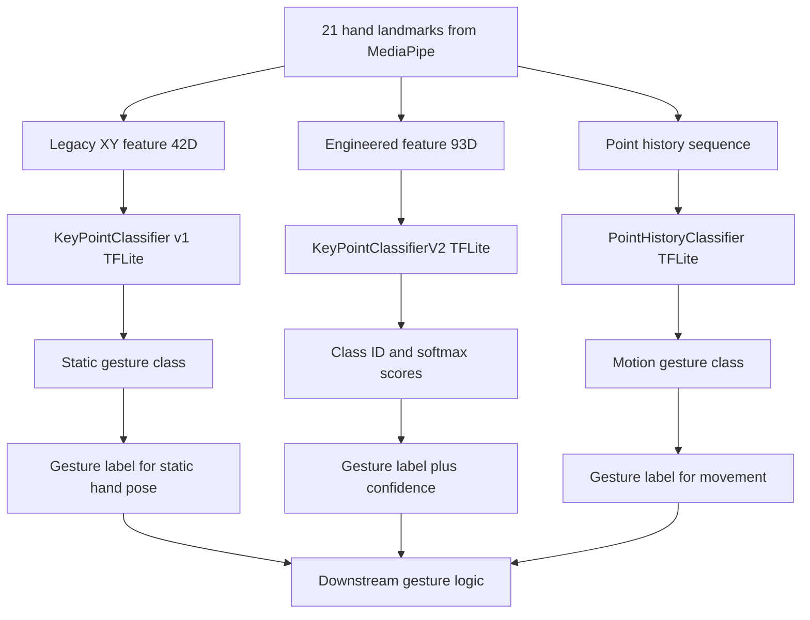

# Kiến trúc Mô Hình DL

Tài liệu này mô tả kiến trúc các mô hình học sâu trong dự án, không mô tả vòng lặp chạy của ứng dụng.

## Tổng quan

Hệ thống hiện có hai nhóm mô hình chính:

1. Mô hình cử chỉ tĩnh dùng đặc trưng từ landmark bàn tay để dự đoán tư thế tay trong một khung hình.
2. Mô hình cử chỉ động dùng chuỗi lịch sử chuyển động của đầu ngón tay để nhận biết thao tác như trỏ, kéo hoặc quỹ đạo ngắn.

Bên cạnh đó, codebase còn có một biến thể đặc trưng mới hơn với vector 93 chiều và classifier v2, nhưng thành phần này chủ yếu phục vụ hướng nâng cấp mô hình.

## Luồng dữ liệu mô hình

- Đầu vào gốc là 21 landmark của MediaPipe Hands, mỗi landmark gồm tọa độ x, y, z.
- Từ cùng một tập landmark này, hệ thống sinh ra nhiều biểu diễn đầu vào khác nhau cho từng mô hình.
- Mỗi mô hình chỉ nhận đúng kiểu đặc trưng mà nó được huấn luyện.

## Các mô hình

### 1. KeyPointClassifier v1

- Vai trò: phân loại cử chỉ tĩnh của bàn tay.
- Đầu vào: vector 42 chiều từ tọa độ XY đã chuẩn hóa tương đối so với cổ tay.
- Đầu ra: class ID của cử chỉ tĩnh.
- Định dạng triển khai: TFLite.

### 2. KeyPointClassifierV2

- Vai trò: biến thể nâng cấp của classifier cử chỉ tĩnh.
- Đầu vào: vector 93 chiều do `FeatureExtractor.extract()` tạo ra.
- Đầu ra: class ID và toàn bộ xác suất softmax.
- Điểm khác biệt chính so với v1: đặc trưng giàu hơn, kết hợp vị trí tương đối, góc khớp, khoảng cách và trạng thái ngón tay.

### 3. PointHistoryClassifier

- Vai trò: phân loại cử chỉ động dựa trên chuỗi chuyển động.
- Đầu vào: chuỗi lịch sử điểm đã chuẩn hóa từ đầu ngón trỏ.
- Đầu ra: class ID của cử chỉ động.
- Định dạng triển khai: TFLite.

## Đặc trưng đầu vào

### 42D legacy keypoint feature

- Dùng cho `KeyPointClassifier` v1.
- Biểu diễn tọa độ XY tương đối của 21 landmark.
- Phù hợp với mô hình nhẹ, đơn giản, dễ triển khai.

### 93D engineered feature

- Dùng cho `KeyPointClassifierV2`.
- Gồm 5 nhóm đặc trưng:

1. Tọa độ 3D tương đối của 21 điểm.
2. Góc cos giữa các khớp ngón tay.
3. Khoảng cách từ đầu ngón tay đến cổ tay.
4. Khoảng cách từ đầu ngón tay đến tâm lòng bàn tay.
5. Trạng thái ngón tay duỗi hoặc gập.

### Point history feature

- Dùng cho `PointHistoryClassifier`.
- Mô tả chuỗi vị trí đầu ngón trỏ theo thời gian.
- Mục tiêu là học động tác thay vì chỉ nhìn một frame riêng lẻ.

## Sơ đồ Mermaid

## Ghi chú kỹ thuật

- `KeyPointClassifier` v1 là mô hình nhẹ, dùng đặc trưng 42D nên phù hợp với suy luận nhanh.
- `KeyPointClassifierV2` mở rộng không gian đặc trưng để tăng khả năng phân biệt giữa các tư thế tay gần giống nhau.
- `PointHistoryClassifier` bổ sung thông tin động học, giúp nhận biết thao tác theo quỹ đạo.
- Các mô hình này được thiết kế theo kiểu phân tầng: đặc trưng -> classifier -> class ID -> logic cấp cao hơn.
- Phần nội suy quyết định, state machine, và ánh xạ sang hành động hệ điều hành là tầng sau mô hình, không thuộc kiến trúc lõi của DL model.
